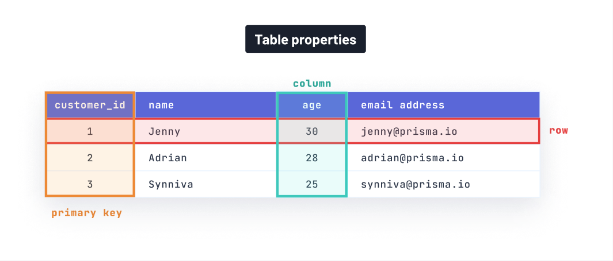

## Introduction


JOINs allow you to combine related data from multiple tables in relational databases. Read on to learn more about what they are, how they work, and how you can utilize them effectively for different relations.

## How data is structured in relational databases

Before diving into JOINs, it’s important to understand the fundamentals of relational databases. Relational databases provide a way to structure and organize information. In relational databases, data is structured into _tables_, with _columns_ (attributes) specifying _data types_ (think strings, integers, etc.) and _rows_ containing records (the values for each of the table’s columns).

Let’s demonstrate this concept with a table holding customer information. In the table below, the columns, or customer attributes, are `name`, `age`, and `email address` and the rows represent each customer’s `name`, `age`, and `email_address`.

| name    | age | email_address     |
| ------- | --- | ----------------- |
| Jenny   | 30  | jenny@prisma.io   |
| Adrian  | 28  | adrian@prisma.io  |
| Synniva | 25  | synniva@prisma.io |

A relational database has the ability to define relationships, or connections, between different tables using _primary_ and _foreign keys_.

All tables in a relational database have a column known as the _primary key_ which uniquely identifies each row. To see how this works in practice, let’s use our previous example: The primary key for the `customers` table would be a column of unique IDs for each customer, called `customer_id`. In other words, no customer would share the same ID as another.



A _foreign key_ is used to create a relationship between tables by referencing the primary key of another table. To demonstrate the concept of foreign keys, let’s say we have another table called `orders` with columns: `order_id`, `cost`, and `order_date`. We can link the `orders` table (left table in diagram) with the `customers` table (right table in diagram) by including a `customer_id` column (foreign key), associating each order with the corresponding customer.


## What are JOINs?

A useful feature of relational databases is the concept of _JOINs_, a type of SQL operation that combines relevant data from distinct tables often based on the primary and foreign key.

The basic syntax of a _JOIN_ operation is as follows:

```sql
SELECT
    *
FROM
    <first_table>
<join_type> <second_table>
    <join_condition>
```

Here is what each part of the query means:

- `SELECT`: specifies which columns you would like to include from the resulting dataset. In our case, it selects all (`*`) columns from the resulting dataset.
- `FROM`: specifies the source table from which data will be retrieved. In our case, it is the first table.
- `<join_type>`: specifies the specific type of JOIN operation you want to perform with the second table.
- `<join_condition>`: represents how the two tables should be joined. It typically consists of equality comparison between columns from the two tables.

Using our example from earlier, when you perform a standard JOIN between the `customers` and `orders` tables, the database looks for matching values in the `customer_id` column of the `orders` table (foreign key) and the `customer_id` column of the `customers` table (primary key). It then combines the rows where these values match into a single result set.

The result set for the tables would be:

| customer_id | name    | age | email_address     | order_id | cost    | order_date |
| ----------- | ------- | --- | ----------------- | -------- | ------- | ---------- |
| 1           | Jenny   | 30  | jenny@prisma.io   | 1        | $150.00 | 4/1/2024   |
| 2           | Adrian  | 28  | adrian@prisma.io  | 2        | $200.00 | 3/29/2024  |
| 1           | Jenny   | 30  | jenny@prisma.io   | 3        | $20.00  | 4/2/2024   |
| 3           | Synniva | 25  | synniva@prisma.io | 4        | $320.00 | 4/4/2024   |

The result set combines the columns from both the `orders` table and `customers` table based on the matching rows from the `customer_id` column. This allows you to see order information alongside the customer information.

## Types of JOINs in PostgreSQL and MySQL

Sometimes you may want to get different rows from each table. There are different types of JOIN operations that will help you achieve this. In this section, we will discuss traditional JOINs supported by MySQL and PostgreSQL (two relational databases) as well as lateral JOINs (only supported by PostgreSQL).

### Traditional JOINs

The most common form of JOIN operations you will encounter are `INNER JOIN`, `LEFT JOIN`, `RIGHT JOIN`, `FULL JOIN`, and `CROSS JOIN`. To demonstrate these JOIN types, we will use the following `customers` and `orders` (modified) tables:

| customer_id | name    | age | email_address     |
| ----------- | ------- | --- | ----------------- |
| 1           | Jenny   | 30  | jenny@prisma.io   |
| 2           | Adrian  | 28  | adrian@prisma.io  |
| 3           | Synniva | 25  | synniva@prisma.io |

| order_id (primary key) | cost    | order_date | customer_id (foreign key) |
| ---------------------- | ------- | ---------- | ------------------------- |
| 1                      | $150.00 | 4/1/2024   | 1                         |
| 2                      | $200.00 | 3/29/2024  | 2                         |
| 3                      | $20.00  | 4/2/2024   | 1                         |

#### `INNER JOIN`

The `INNER JOIN` is the default JOIN and returns rows from both tables only where there is a match. Here is the associated query for the `customers` and `orders` table:

```sql
SELECT
    *
FROM
    customers
INNER JOIN orders
    ON customers.customer_id = orders.customer_id;
```

Here is the result table after using an `INNER JOIN`:

| customer_id | name   | age | email address    | order_id | cost    | order_date |
| ----------- | ------ | --- | ---------------- | -------- | ------- | ---------- |
| 1           | Jenny  | 30  | jenny@prisma.io  | 1        | $150.00 | 4/1/2024   |
| 1           | Jenny  | 30  | jenny@prisma.io  | 3        | $20.00  | 4/2/2024   |
| 2           | Adrian | 28  | adrian@prisma.io | 2        | $200.00 | 3/29/2024  |

When depicted as a Venn diagram, an `INNER JOIN` represents the overlapping region of the two circles. In other words, only the values existing in both tables are included.


#### `LEFT JOIN`

A `LEFT JOIN` returns all rows found using the `INNER JOIN` and all records from the first table. Here is the associated query for the `customers` and `orders` table:

```sql
SELECT
    *
FROM
    customers
LEFT JOIN orders
    ON customers.customer_id = orders.customer_id;
```

Here is the result table after using a `LEFT JOIN`:

| customer_id | name    | age | email address     | order_id | cost    | order_date |
| ----------- | ------- | --- | ----------------- | -------- | ------- | ---------- |
| 1           | Jenny   | 30  | jenny@prisma.io   | 1        | $150.00 | 4/1/2024   |
| 1           | Jenny   | 30  | jenny@prisma.io   | 3        | $20.00  | 4/2/2024   |
| 2           | Adrian  | 28  | adrian@prisma.io  | 2        | $200.00 | 3/29/2024  |
| 3           | Synniva | 25  | synniva@prisma.io | NULL     | NULL    | NULL       |

When depicted as a Venn diagram, a `LEFT JOIN` represents the entire left circle. In other words, the matching values from both tables will be included along with all records from the `customers` table.


#### `RIGHT JOIN`

A `RIGHT JOIN` returns all rows found using the `INNER JOIN` and all records from the second table*.* Here is the associated query for the `customers` and `orders` table:

```sql
SELECT
    *
FROM
    customers
RIGHT JOIN orders
    ON customers.customer_id = orders.customer_id;
```

Here is the result table after using a `RIGHT JOIN`:

| customer_id | name   | age | email address    | order_id | cost    | order_date |
| ----------- | ------ | --- | ---------------- | -------- | ------- | ---------- |
| 1           | Jenny  | 30  | jenny@prisma.io  | 1        | $150.00 | 4/1/2024   |
| 1           | Jenny  | 30  | jenny@prisma.io  | 3        | $20.00  | 4/2/2024   |
| 2           | Adrian | 28  | adrian@prisma.io | 2        | $200.00 | 3/29/2024  |

In this case, the result is the same as an `INNER JOIN` as each order has a corresponding customer.

When depicted as a Venn diagram, a `RIGHT JOIN` represents the entire right circle. In other words, the matching values from both tables will be included along with all records from the `orders` table.


#### `FULL JOIN`

A `FULL JOIN` returns all rows when there is a match in either table. Here is the associated query for the `customers` and `orders` table in PostgreSQL:

```sql
SELECT
    *
FROM
    customers
FULL JOIN orders
    ON customers.customer_id = orders.customer_id;
```

MySQL does not natively support `FULL JOIN`s. As a workaround, we can use a `LEFT JOIN` combined with an “anti-JOIN,” which is a JOIN operation that finds results that are _not_ in common between tables (specified by the `NULL`). The `UNION ALL` allows us to combine these together.

```sql
  (SELECT *
   FROM customers
   LEFT JOIN orders ON customers.customer_id = orders.customer_id)
UNION ALL
  (SELECT *
   FROM customers
   RIGHT JOIN orders ON customers.customer_id = orders.customer_id
   WHERE customers.customer_id IS NULL );
```

Here is the result table after using a `FULL JOIN`:

| customer_id | name    | age | email address     | order_id | cost    | order_date |
| ----------- | ------- | --- | ----------------- | -------- | ------- | ---------- |
| 1           | Jenny   | 30  | jenny@prisma.io   | 1        | $150.00 | 4/1/2024   |
| 1           | Jenny   | 30  | jenny@prisma.io   | 3        | $20.00  | 4/2/2024   |
| 2           | Adrian  | 28  | adrian@prisma.io  | 2        | $200.00 | 3/29/2024  |
| 3           | Synniva | 25  | synniva@prisma.io | NULL     | NULL    | NULL       |

In this case, the result would be the same as a `LEFT JOIN` as every record from the `customers` table has a match in the `orders` table.

When depicted as a Venn diagram, a `FULL JOIN` represents both circles. In other words, a `FULL JOIN` combines all records from both tables.


#### `CROSS JOIN`

A `CROSS JOIN` returns the [Cartesian product](https://www.sciencedirect.com/topics/computer-science/cartesian-product) of the two tables, meaning every row from the first table is combined with every row from the second table. In this syntax, the result is formed by adding each of the rows in the first table with each of the rows from the second table like so:

```sql
t1.r1 + t2.r1
t1.r1 + t2.r2
t1.r1 + t2.r3
t1.r2 + t2.r1
t1.r2 + t2.r2
t1.r2 + t2.r3
t1.r3 + t2.r1
t1.r3 + t2.r2
t1.r3 + t2.r3
```

> **Note:** In MySQL, the concept of a `CROSS JOIN` is combined with the `INNER JOIN`. Read more in the [data guide](https://www.prisma.io/dataguide/mysql/reading-and-querying-data/joining-tables#different-types-of-joins).

With a `CROSS JOIN`, each row from the `customers` table is combined with each row from the `orders` table, resulting in a total of 9 rows. However, we won’t show the result table as a `CROSS JOIN` wouldn’t accurately pair the customer with their respective orders.

To learn more about database-specific details of JOIN operations, check out these additional pages in the data guide:

- [JOINs in PostgreSQL](https://www.prisma.io/dataguide/postgresql/reading-and-querying-data/joining-tables)
- [JOINs in MySQL](https://www.prisma.io/dataguide/mysql/reading-and-querying-data/joining-tables)

### LATERAL JOINs

Lateral JOINs offer a different syntax to combining tables compared to traditional JOINs. In a `LATERAL JOIN`, the second table is presented as a _subquery_, and the JOIN criteria is defined within the `WHERE` clause of the subquery.

According to the [PostgreSQL](https://www.postgresql.org/docs/9.3/sql-select.html#SQL-FROM) docs, “The `LATERAL` key word can precede a sub-`SELECT FROM` item. This allows the sub-`SELECT` to refer to columns of `FROM` items that appear before it in the `FROM` list. (Without `LATERAL`, each sub-`SELECT` is evaluated independently and so cannot cross-reference any other `FROM` item.)”

> **Note:** `LATERAL JOIN`s are supported by Postgres but only supported in [MySQL versions >8](https://dev.mysql.com/blog-archive/support-for-lateral-derived-tables-added-to-mysql-8-0-14/)

In other words, a `LATERAL JOIN` is like a foreach loop, where PostgreSQL iterates over each row in a result set and uses each row to evaluate the subquery.

Here is the associated query for the `customers` and `orders` table:

```sql
SELECT *
FROM customers
LEFT JOIN LATERAL
  (SELECT *
   FROM orders
   WHERE orders.customer_id = customers.customer_id ) AS ALIAS ON TRUE;
```

Here is the result table after using a `LATERAL JOIN`:

| customer_id | name    | age | email address     | order_id | cost    | order_date |
| ----------- | ------- | --- | ----------------- | -------- | ------- | ---------- |
| 1           | Jenny   | 30  | jenny@prisma.io   | 1        | $150.00 | 4/1/2024   |
| 1           | Jenny   | 30  | jenny@prisma.io   | 3        | $20.00  | 4/2/2024   |
| 2           | Adrian  | 28  | adrian@prisma.io  | 2        | $200.00 | 3/29/2024  |
| 3           | Synniva | 25  | synniva@prisma.io | NULL     | NULL    | NULL       |

In this case, the result would be the same as a `LEFT JOIN` and `FULL JOIN`.

<PrismaOutlinks>

💡 Prisma ORM makes it easy to query relations between tables without thinking about the intricacies and low-level complexities of SQL operations. Read the docs to learn more about [relation queries](https://www.prisma.io/docs/orm/prisma-client/queries/relation-queries).

</PrismaOutlinks>

## Implementing JOINs for different relations

It’s important to understand database _relations_ when selecting the appropriate JOIN type. In the context of databases, relations describe a relationship between tables in a database.

In this section, we will illustrate both the one-to-one and the one-to-many relations along with considerations for selecting the appropriate JOIN type for each.

### One-to-one (1-1)

In a one-to-one relation, each record in one table is associated with exactly one record in another table, and vice versa. Here is an example SQL schema demonstrating a one-to-one relation between `User` and `Profile` models:

```sql
CREATE TABLE "User" (
    "id" INTEGER NOT NULL PRIMARY KEY AUTOINCREMENT,
    "email" TEXT NOT NULL
);

CREATE TABLE "Profile" (
    "name" TEXT NOT NULL,
    "gender" TEXT NOT NULL,
    "age" TEXT NOT NULL,
    "userEmail" TEXT NOT NULL,
    CONSTRAINT "Profile_userEmail_fkey" FOREIGN KEY ("userEmail") REFERENCES "User" ("email") ON DELETE RESTRICT ON UPDATE CASCADE
);

CREATE UNIQUE INDEX "User_email_key" ON "User"("email");

CREATE UNIQUE INDEX "Profile_userEmail_key" ON "Profile"("userEmail");

```

This means that a user can have only one profile, and a profile can belong to only one user.

In one-to-one relations, JOINs are straightforward. You can use a traditional `INNER JOIN` to combine the users with their profiles. Here is an example query:

```sql
SELECT
		user.id, user.email, profile.name, profile.gender, profile.age
FROM
		user
INNER JOIN profile
		ON user.email = profile.user_email;
```

When performing an `INNER JOIN` between the two tables, we would get a result set where each row contains columns from both tables, matched based on the relationship criteria. Here is an example result set:

| id  | email             | name    | gender | age |
| --- | ----------------- | ------- | ------ | --- |
| 1   | meera@prisma.io   | Meera   | Female | 30  |
| 2   | xander@prisma.io  | Xander  | Male   | 30  |
| 3   | zara@prisma.io    | Zara    | Female | 32  |
| 4   | artemis@prisma.io | Artemis | Male   | 32  |

When you join the `User` and `Profile` tables using the `INNER JOIN` and the specified join condition, each row in the result set represents a user along with their corresponding profile. In other words, we include the `id` and `email` columns from the user table, along with the `name`, `gender`, and `age` of those users from the `Profile` table.

### One-to-many (1-n)

In a one-to-many relationship, each record in one table can be associated with multiple records in another table. Here is an example SQL schema demonstrating a one-to-many relation between `User` and `Post` models:

```sql
CREATE TABLE "User" (
    "id" INTEGER NOT NULL PRIMARY KEY AUTOINCREMENT,
    "email" TEXT NOT NULL
);

CREATE TABLE "Post" (
    "id" INTEGER NOT NULL PRIMARY KEY AUTOINCREMENT,
    "title" TEXT NOT NULL,
    "authorId" INTEGER NOT NULL,
    CONSTRAINT "Post_authorId_fkey" FOREIGN KEY ("authorId") REFERENCES "User" ("id") ON DELETE RESTRICT ON UPDATE CASCADE
);

CREATE UNIQUE INDEX "User_email_key" ON "User"("email");

```

This means that one user can have multiple posts, but each post is linked to only one user.

When dealing with one-to-many relations, traditional JOINs can lead to duplicated data. Consider the following query:

```sql
SELECT
		user.id, user.email, post.id AS post_id, post.title AS post_title
FROM
		user
INNER JOIN post
		ON user.id = post.authorId;

```

Here is an example result set based on the query above:

| id  | email           | post_id | post_title                 |
| --- | --------------- | ------- | -------------------------- |
| 1   | jenny@prisma.io | 1       | Introduction to Prisma ORM |
| 1   | jenny@prisma.io | 2       | Introduction to JOINs      |
| 1   | jenny@prisma.io | 3       | Introduction to SQL        |
| 2   | meera@prisma.io | 4       | Using Prisma Client        |

As you can see in the result set, Jenny's email gets duplicated over multiple rows for each of her posts. As we incorporate more nested relations, result sets may become bloated. This can make it harder to interpret the data.

To address this duplication, we can pair `LATERAL JOIN`s with JSON aggregation. JSON aggregation helps avoid duplication by consolidating multiple related records into a single field as a JSON array, while `LATERAL JOIN`s help improve readability and can optimize performance.

Here is an example of what the result set would look like using `LATERAL JOIN`s with JSON aggregation:

| id  | email           | post_titles                                                                                                                      |
| --- | --------------- | -------------------------------------------------------------------------------------------------------------------------------- |
| 1   | jenny@prisma.io | `[{"post title": "Introduction to Prisma ORM"}, {"post title": "Introduction to JOINs"}, {"post title": "Introduction to SQL"}]` |
| 2   | meera@prisma.io | `[{"post title": "Using Prisma Client"}]`                                                                                        |

As you can see, `LATERAL JOIN`s combined with JSON aggregation leads to a cleaner result set with no unnecessary duplication. Each of Jenny’s posts got consolidated into a JSON array, transforming three rows from the previous result set into one.

> **Note:** A many-to-many (m-n) is not discussed in this context because it describes two 1-n relations and hence would be supported with the same type of JOIN

## Conclusion

To wrap up, we introduced the concept of JOINs and how they allow us to combine related data from tables in relational databases. We explored how data is organized in relational databases, and the significance of primary and foreign keys in forming relationships between tables. We then discussed different types of joins in MySQL and PostgreSQL and determined the appropriate type of join, whether it be traditional or lateral, to use for both one-to-one and one-to-many relations.

<PrismaOutlinks>

💡 JOINs can be very complicated in real-world applications, especially if you add more conditions to a query, e.g. filtering and pagination. Prisma ORM lets you easily query relations and figures out an effective JOIN query for you under the hood. Read the docs to learn more about [relation queries](https://www.prisma.io/docs/orm/prisma-client/queries/relation-queries).

</PrismaOutlinks>
