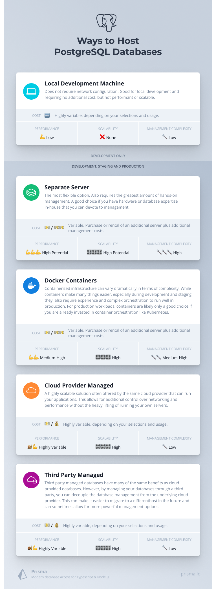

## Introduction

There are many ways to acquire a [PostgreSQL](/intro/database-glossary#postgresql) instance for your projects or organizations to use. You can learn how to install and configure PostgreSQL yourself or you can pay service providers to manage your PostgreSQL databases for you.

This guide will cover different ways to run PostgreSQL and their respective benefits and drawbacks. By comparing the different options, you should come away with a better idea of what type of solution is best for your project or development stage.

- [Self-Managed PostgreSQL](#self-managed-postgresql)
  - [Installing on a local development computer](#installing-postgresql-on-your-local-development-computer)
  - [Installing on a separate server](#installing-postgresql-on-a-separate-server)
  - [PostgreSQL with Docker](#postgresql-with-docker)
- [Managed services](#managed-services)
  - [Databases managed by cloud providers](#databases-managed-by-cloud-providers)
  - [Third-party managed databases](#third-party-managed-databases)

## Self-managed PostgreSQL

The most flexible and simplest to describe option is self-hosting your PostgreSQL server. Self-hosting PostgreSQL means that you install and configure your databases on computers that you control, just like any other piece of software.

Self-hosting gives you a lot of choice as to where you will install and run your databases. If you choose one of the options in this section, you can use this guide to learn [how to install PostgreSQL on your systems](/postgresql/setting-up-a-local-postgresql-database).

### Installing PostgreSQL on your local development computer

For early development, testing, and proof of concepts, installing PostgreSQL on your local development machine can provide reliable, easy to manage access to your databases.

| Hosting Option            | Local development machine                                                 |
| ------------------------- | ------------------------------------------------------------------------- |
| **Project stage**         | Development                                                               |
| **Cost**                  | No additional costs                                                       |
| **Performance**           | Low                                                                       |
| **Scalability**           | None                                                                      |
| **Management complexity** | Low                                                                       |
| **Additional notes**      | Does not require network configuration. Good   for local development. |

#### Cost

Setting up PostgreSQL on your development machine is free of cost. You are running the database from a computer that would already be active as you develop. You only need to consider the amount of resources that PostgreSQL will consume when up and running.

#### Performance

Installing PostgreSQL on your development machine is a low performance option.

Your database will not be easily or reliably available to other users. Your own usage of the database will be limited by your hardware and the amount of resources you can spare for PostgreSQL. These concerns are not typically an issue when testing or developing locally, but are entirely inadequate for anything more complex.

#### Scalability

Hosting on your development machine gives you almost no [scalability](/intro/database-glossary#scaling). You can change the amount of resources allocated to PostgreSQL, but not much more. You can upgrade your development machine, but that is neither practical or particularly useful in the long term.

#### Management complexity

In terms of complexity, hosting PostgreSQL on your local machine is often fairly straightforward. The installation process for most operating systems is well thought out and the resulting database can be started or stopped easily. Configuring your local PostgreSQL instance for external access is usually not worth the effort however given the resource limitations and consumer network instability.

Though setting up PostgreSQL locally is not complex, you will still be required to manage your database and perform any upgrades as necessary. These might be required for security patching occasionally and it will be your responsibility to keep track of these instances if you are concerned about your data.

#### Additional notes

Installing locally means that your databases will be accessible from your development computer even when the network is down. This can be especially helpful when traveling. Accessing your data locally removes network complexity, allowing you to focus on development instead of database access.

Installing PostgreSQL on your local development computer is useful but has some pretty clear limitations. You can't easily configure multi-user access and your database uptime is tied directly to your computer's availability and network stability. For these reasons, installing on your development machine is nearly always a supplemental option meant to increase your productivity and flexibility, never the only database installation.

### Installing PostgreSQL on a separate server

Another self-hosting option is to install and manage PostgreSQL on a separate computer. Some common implementations include:

- **Installing on a dedicated server:** PostgreSQL is configured to be the only service running on a dedicated computer. It has access to all of the machine's resources.
- **Installing alongside related applications:** PostgreSQL is installed alongside the applications that require it. This is a popular choice for small deployments because all of the components can be managed on a single machine. The computer's resources must be shared between PostgreSQL and other running applications.

Installing PostgreSQL on a separate server looks very different from installing on a development machine:

| Hosting Option            | Separate server                                                                                                                                                                                            |
| ------------------------- | ---------------------------------------------------------------------------------------------------------------------------------------------------------------------------------------------------------- |
| **Project stage**         | Development, staging, production                                                                                                                                                                           |
| **Cost**                  | Variable. Purchase or rental of an additional   server plus additional management costs.                                                                                                               |
| **Performance**           | High potential                                                                                                                                                                                             |
| **Scalability**           | High potential                                                                                                                                                                                             |
| **Management complexity** | High                                                                                                                                                                                                       |
| **Additional notes**      | The most flexible option. Also requires the greatest   amount of hands-on management. A good choice if   you have hardware or database expertise in-house   that you can devote to management. |

One consideration that demands further emphasis is that when managing PostgreSQL by yourself, security is your responsibility. If you already handle infrastructure, software, and network security are for other parts of your organization, this might not be an issue. If you are less familiar, however, securing your PostgreSQL instance, and the data that it holds, may be a significant challenge. Make sure to factor this into your planning before deciding to take this path.

#### Cost

Running PostgreSQL on a dedicated or shared machine requires you to purchase or rent the server space you will use. The actual server may be located on-premise at your organization, collocated in a data center, or operated as a virtual machine (also known as virtual private servers or VPSs) hosted by a cloud provider.

The costs of a server can be highly variable. Low powered VPSs can be quite inexpensive, while multiple dedicated servers will quickly become costly. The cost of the server, however, is not the only consideration. You must also factor in the additional management costs. Depending on your deployment environment, this might include personnel costs to manage the database layer, the server's software, and the hardware. These costs will depend on your availability requirements, hosting environment, and the scale of your operations.

#### Performance

Deploying PostgreSQL on separate servers has the potential for very high performance. Since the specifications for the machines that will run PostgreSQL are under your control, you have complete flexibility to choose hardware that matches your needs. If you need to expand in the future, you can upgrade your hardware or purchase additional servers to scale your workloads.

You also have the ability to fine tune your database configuration to gain additional performance benefits. You can tweak settings related to memory management, caching, open file handling, client connections, and more. While this provides you with a lot of power, taking advantage of these options requires time, expertise, and experimentation. As with other aspects of running your own server, the benefits are limited by the time and money you are able to allocate to this aspect of your project.

#### Scalability

As mentioned above, running on dedicated servers allows you to react to changing demands on your database system. You can scale _up_ by addition additional resources and hardware to your database server, or you can scale _out_ by balancing your requests across a pool of PostgreSQL servers. Both options are reasonable responses to different types of stress.

#### Management complexity

Generally speaking, scaling has the same advantages and limitations as performance tuning: you have incredible flexibility and power, but you are responsible for managing the costs and configuration. Any changes that require additional hardware (such as an increase in demand) must be coupled with proactive monitoring to allow your organization time to procure hardware, configure the software, and balance your workloads.

#### Additional notes

In summary, managing your own PostgreSQL can be incredibly efficient, powerful, and flexible, but can require a large amount of dedicated time and resources. This option is best for organizations with internal infrastructure and server expertise who want control over their database's runtime environment, configuration, and architecture topology.

### PostgreSQL with Docker

Another self-hosting option is to use [Docker](https://www.docker.com/) to run PostgreSQL as a container. Docker allows you run PostgreSQL in an isolated environment on a local or remote machine.

| Hosting Option            | Docker containers                                                                                                                                                                                                                                                                                                                                                                                                                      |
| ------------------------- | -------------------------------------------------------------------------------------------------------------------------------------------------------------------------------------------------------------------------------------------------------------------------------------------------------------------------------------------------------------------------------------------------------------------------------------- |
| **Project stage**         | Development, staging, production                                                                                                                                                                                                                                                                                                                                                                                                       |
| **Cost**                  | Variable. Purchase or rental of an additional   server plus additional management costs.                                                                                                                                                                                                                                                                                                                                           |
| **Performance**           | Medium-High                                                                                                                                                                                                                                                                                                                                                                                                                            |
| **Scalability**           | High                                                                                                                                                                                                                                                                                                                                                                                                                                   |
| **Management complexity** | Medium-High                                                                                                                                                                                                                                                                                                                                                                                                                            |
| **Additional notes**      | Containerized infrastructure can vary dramatically   in terms of complexity. While containers make   many things easier, especially during development   and staging, they also require experience and   complex orchestration to run well in production.   For production workloads, containers are likely   only a good choice if you are already invested in   container orchestration like Kubernetes. |

Some of the benefits of using Docker over a traditional local installation include:

- Running PostgreSQL with the official [PostgreSQL Docker image](https://hub.docker.com/_/postgres) requires less effort compared to installing PostgreSQL.
- Docker allows you to reproduce the exact same database configuration across multiple environment which is useful for teams collaborating on a project requiring the same PostgreSQL configuration.
- You can use Docker to control the CPU, memory, and storage resources allocated to PostgreSQL.
- Docker reduces the potential for incompatibilities between PostgreSQL and other software running on your machine.

Installing PostgreSQL with Docker locally or on a remote machine is similar, though there are some additional considerations depending on whether you use PostgreSQL for production workloads.

While Docker simplifies certain aspects of running PostgreSQL, there are a few trade-offs to be aware of:

- Depending on your configuration, running with Docker can increase the complexity of your network configuration.
- Docker adds an additional layer of abstraction, which requires additional security considerations and has the potential to make troubleshooting less direct.

#### Containers and Kubernetes

With [Kubernetes](https://kubernetes.io/), you can run Docker containers on a cluster consisting of multiple servers. If one server in the cluster needs to be taken down for maintenance, Kubernetes will move the PostgreSQL container to another server as long as the underlying data partition is accessible. You can also run your application that uses PostgreSQL on Kubernetes, which can reduce network latency between the application and PostgreSQL.

## Managed services

An alternative to running PostgreSQL on your own is to rent or purchase PostgreSQL databases from a provider. Managed services allow you to easily work with your database as a service or API without having to worry about the behind-the-scenes management of the PostgreSQL software or the underlying servers.

Different types of managed services exist to serve different needs. This section will cover services provided by hosting or cloud providers, third-party managed databases, and databases provided by application platforms.

### Databases managed by cloud providers

Perhaps the most familiar type of managed PostgreSQL hosting is the kind offered by cloud or hosting providers. Some examples of these include Amazon Web Service's RDS (relational database service), Google Cloud Platform's Cloud SQL, and Azure Database.

| Hosting Option            | Cloud provider-managed                                                                                                                                                                                                                                |
| ------------------------- | ----------------------------------------------------------------------------------------------------------------------------------------------------------------------------------------------------------------------------------------------------- |
| **Project stage**         | Development, staging, production                                                                                                                                                                                                                      |
| **Cost**                  | Highly variable, depending on your selections   and usage.                                                                                                                                                                                        |
| **Performance**           | Highly variable                                                                                                                                                                                                                                       |
| **Scalability**           | High                                                                                                                                                                                                                                                  |
| **Management complexity** | Low                                                                                                                                                                                                                                                   |
| **Additional notes**      | A highly scalable solution often offered by   the same cloud provider that can run your   applications. This allows for additional control   over networking and performance without the   heavy lifting of running your own servers. |

Cloud providers offer a wide variety of PostgreSQL databases fine-tuned to run in their data centers and operate seamlessly with their other services.

#### Cloud providers

The following cloud providers offer managed PostgreSQL databases that you can purchase, configure, and scale as your needs require:

- [Amazon AWS](https://aws.amazon.com/rds/postgresql/)
- [DigitalOcean](https://www.digitalocean.com/products/managed-databases-postgresql/)
- [Google Cloud](https://cloud.google.com/sql)
- [Heroku](https://www.heroku.com/postgres)
- [IBM](https://www.ibm.com/cloud/databases-for-postgresql)
- [Microsoft Azure](https://azure.microsoft.com/en-us/services/postgresql/)
- [Neon](https://neon.tech)
- [Render](https://render.com/pricing#databases)
- [Supabase](https://supabase.com)

The server and majority of PostgreSQL will be managed by the hosting provider, while you will be able to set up scaling options, tweak settings, and manage access. You can configure your databases to be connectable from the internet or connect them directly to your applications that are managed by the same provider.

#### Cost

PostgreSQL databases managed by cloud providers can have a wide range of costs. On the low end, some providers offer a free tier with minimal performance and uptime. At the high end, scaling automatically to meet any demand can cost you thousands of dollars overnight if you get an unexpected bump in traffic. As with most things in the cloud, your actual usage will impact your bill each month. Many clouds offer cost alerts or even automatic offs if usage / costs go above a certain point. It is important to monitor your usage and configure cutoffs to manage the operating costs of your database systems.

#### Scalability

Though costs can at times be difficult to predict, the good new is that scaling is incredibly easy in the cloud. The resources allocated to your databases are configurable on-the-fly. This means that you can increase the storage capacity, memory and computing power, or the number of replicas managing your data just by changing settings in your account. One of the powerful features that, if not configured carefully, can contribute to high costs is the ability to dynamically scale your database's resources according to the current demand. This allows you to always have the capacity to serve your requirements assuming that you can cover the costs.

#### Performance

Related to scalability, performance is another area that is incredibly flexible in the cloud. You can often fine-tune the settings that have the largest impact on your database's performance according to your usage patterns. You can also allocate additional resources if your current configuration is underpowered. Collocating your databases with the applications that use them can also help give you good networking performance between your databases and applications.

#### Management complexity

In terms of management complexity, cloud-hosted databases are fairly simple. You are paying the provider to shoulder most of the management burden for you. While you still need to control your account and the settings that affect your database, the hardware, operating system, and the majority of the PostgreSQL configuration will be handled for you. This can have a huge impact in reducing the management overhead of using a database, but in some special cases, you may not have access to the level of tuning you desire.

#### Additional notes

In general, paying for PostgreSQL databases managed by a cloud provider is usually an attractive option. It provides great flexibility in regards to scaling and performance with a smaller amount of management work. The drawbacks of going with a cloud provider's database offering is that you might end up paying more than you would otherwise at certain levels. Additionally, there is the danger of being trapped with your current provider if your tooling begins to depend too heavily on provider-specific functionality.

### Third party managed databases

An alternative to purchasing databases directly from your cloud provider, you can instead choose to manage your databases through a third-party provider. In most cases, this option will deploy and manage databases onto the cloud or clouds of your choice, decoupling the database management from the underlying resource providers.

| Hosting Option            | Third party-managed                                                                                                                                                                                                                                                                                                                                                                                            |
| ------------------------- | -------------------------------------------------------------------------------------------------------------------------------------------------------------------------------------------------------------------------------------------------------------------------------------------------------------------------------------------------------------------------------------------------------------- |
| **Project stage**         | Development, staging, production                                                                                                                                                                                                                                                                                                                                                                               |
| **Cost**                  | Highly varied, depending on your selections   and usage.                                                                                                                                                                                                                                                                                                                                                   |
| **Performance**           | Highly variable                                                                                                                                                                                                                                                                                                                                                                                                |
| **Scalability**           | High                                                                                                                                                                                                                                                                                                                                                                                                           |
| **Management complexity** | Low                                                                                                                                                                                                                                                                                                                                                                                                            |
| **Additional notes**      | Third party managed databases have many of   the same benefits as cloud provided databases.   However, by managing your databases through   a third party, you can decouple the database   management from the underlying cloud provider.   This can make it easier to migrate to a different   host in the future and can sometimes allow for   more powerful management options. |

Databases managed by a third party provider often use the same fundamental components as those offered by cloud providers themselves. However, third party providers often work with multiple clouds, spin up resources in your account, and often give you lower-level access if you desire. Instead of using the databases provided by a cloud provider, the service will start up virtual servers on the provider and install and configure PostgreSQL using these. They can tune settings on the operating system and provide you access to the server hosting your instances. An example of third party PostgreSQL providers is [ElephantSQL](https://www.elephantsql.com/), which currently can manage instances in [four different clouds](https://www.elephantsql.com/plans.html#regions).

#### Third-party offerings

The following third-party providers offer managed PostgreSQL databases that you can purchase, configure, and scale as your needs require:

- [Aiven](https://aiven.io/postgresql)
- [Compose](https://www.compose.com/databases/postgresql)
- [Database Labs](https://www.databaselabs.io/pricing/)
- [ScaleGrid](https://scalegrid.io/postgresql/)

The server and majority of PostgreSQL will be managed by the provider, while you will be able to set up which cloud platform it the database runs on, scaling options, tweak settings, and manage access. You can configure your databases to be connectable from the internet or connect them directly to your applications that are managed by the same provider.

#### Cost

In terms of cost, third party solutions are often also highly variable. As a user, you will have to pay for the compute resources in the cloud you deploy to, as well as the management costs that your database management service charges. Since you are paying the cloud provider for more basic resources instead of a managed database, the costs on that side may be smaller. However, the costs associated with the management service might make it more expensive cumulatively at some price points. You will have to figure out how each side scales at different levels to determine what your total costs will be.

#### Performance

The performance characteristics of your database can also vary significantly. Since your management service is installing on compute instances in the cloud, your provider has the ability to tune the server configuration in addition to the PostgreSQL settings. This means that they may be able to adjust some settings to more reasonably match your needs.

On the other hand, they may not have access to the low-level layers of the virtualization and hardware components necessary to tune sufficiently. It is highly recommended to test your performance against the native databases offered by the cloud provider.

#### Scalability

Scalability for third party-managed databases is generally very good. Because these providers can deploy on any compute instance with sufficient resources, they can sometimes offer you a wider variety of scaling options than the cloud provider exposes. If one of your reasons for scaling is to increase availability, many third party services have the ability to span multiple availability zones or even providers.

#### Management complexity

Third party services for managing your databases have a range of complexity. Because this option requires coordination between two different providers (the cloud that hosts the compute instances and the database management service), there is an inherent increase in complexity compared to using the native database service offered by a cloud provider.

Some management services position themselves as a simplified option, hiding away complexity in much the same way as shared web hosting. Other solutions leverage the fact that the operating system is accessible to expose a wide array of configuration options to users. Many services offer both experiences to allow users to find their own preferred level of complexity.

#### Additional notes

Decoupling the database management from the underlying resource provider has both advantages and disadvantages.

You may have more flexibility in migrating to a different cloud provider if your database management service abstracts the underlying layer. This abstraction also gives you the ability to choose the level of complexity you are comfortable with. You can use the full abstraction and interface provided by the database management service, but since you also have access to the database servers provisioned for you, you can log in and modify the database servers as you see fit. The database management service may also provide an easy interface to manage these operating system-level tweaks.

The disadvantages of this setup come from that fact that you would be relying on multiple parties for the correct operation of your databases. This can increase the chances of service interruption. You also may miss out on any under the hood optimizations available for database services offered by your cloud provider. Your database management service will only have access to what your cloud provider exposes to them and they will be unable to optimize the underlying virtualization or hardware layers.

Overall, using a third party management service is about preferences and testing. You will need to test performance and understand how the pricing structure may affect you at various levels of usage.

## In summary

Here is an overview of how the various options discussed here compare to one another:

The right choice for hosting your database depends significantly on your applications' requirements, the stage of your development, and your ability to manage PostgreSQL on your own. Different choices offer trade-offs between these factors that make them more appropriate at certain times or for certain organizations.

<PrismaOutlinks>

Once you have a PostgreSQL database, you can use [Prisma Client](https://www.prisma.io/docs/orm/prisma-client) to manage it from within your JavaScript or TypeScript applications. Learn how to add Prisma to an [existing project](https://www.prisma.io/docs/getting-started/setup-prisma/add-to-existing-project/relational-databases-typescript-postgresql) or how to [start with Prisma from scratch](https://www.prisma.io/docs/getting-started/setup-prisma/start-from-scratch/relational-databases-typescript-postgresql).

</PrismaOutlinks>
