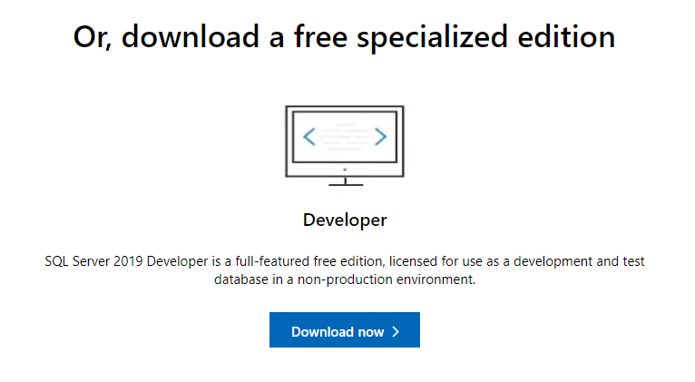

## Overview

In this guide, we'll talk about how to install and configure a [SQL Server instance](https://www.microsoft.com/en-us/sql-server/sql-server-2019) and the [`sqlcmd` command line client](https://docs.microsoft.com/en-us/sql/tools/sqlcmd-utility). We will go over how to install and set up these components on your computer for local access.

This guide will cover the following platforms:

- [Setting up SQL Server on Windows](#setting-up-sql-server-on-windows)
- [Setting up SQL Server on macOS (with Docker)](#setting-up-sql-server-on-macos)
- [Setting up SQL Server on Linux](#setting-up-sql-server-on-linux)
  - [Ubuntu](#ubuntu)
  - [CentOS and Red Hat](#centos-and-red-hat)
  - [With Docker](#with-docker)

Navigate to the sections that match the platforms you will be working with.

## Setting up SQL Server on Windows

Microsoft provides native Windows installers for SQL Server on their site and offers various versions of SQL Server suitable for different purposes. For the purposes of this guide, we will download and install the free Developer edition. You can easily upgrade to a paid version from the Developer edition if you want to use it for production.

To begin, visit [Microsoft's page for SQL Server](https://www.microsoft.com/en-us/sql-server/sql-server-downloads). Find the section related to the Developer edition and click **Download now**:



Once the download completes, double click on the file to run the installer (you may have to confirm that you wish to allow the program to make changes to your computer).

On the initial screen of the installer, you will be asked to choose what type of installation you want to perform:


Choose **Basic** to continue on with a conventional installation using the most common options.

Next, you'll be asked to agree to the Developer Edition licensing terms:


When you have read the license and agree to the terms, click **Accept** to continue.

Next, confirm or change the installation location:


When you are ready, click **Install** to begin the installation process.

The installer will begin to download and install components to set up SQL Server on your computer:


When the installation is finished, a screen will appear noting the current installation properties:


To connect to the new SQL Server instance right away, click **Connect Now** at the bottom.

A new window will `Cmd` window will appear and automatically log you into the SQL Server instance using the `sqlcmd` client:


As shown in a comment at the top of the window, you can connect to SQL Server manually at any time with the `sqlcmd` client by typing:

```
sqlcmd -S <yourhostname> -E
```

To exit the current SQL session, type:

```
EXIT
```

<PrismaOutlinks>

If you are using [Prisma Client](https://www.prisma.io/docs/concepts/components/prisma-client) with SQL Server, you can use the [SQL Server connector](https://www.prisma.io/docs/concepts/database-connectors/sql-server) to connect, map your models, and manage your data.

You can also check out our guides to see how to use Prisma with Microsoft SQL Server on a [new project](https://www.prisma.io/docs/getting-started/setup-prisma/start-from-scratch/relational-databases-typescript-sqlserver) or in an [existing project](https://www.prisma.io/docs/getting-started/setup-prisma/add-to-existing-project/relational-databases-typescript-sqlserver).

</PrismaOutlinks>

## Setting up SQL Server on macOS

While Microsoft does not provide a native installer for macOS, they do support running SQL Server on macOS through Docker. The main [SQL Server Docker container](https://hub.docker.com/_/microsoft-mssql-server) is built using a Linux container, allowing any host capable of running Docker containers to run the database server.

You'll need at least 2 GB of memory (probably at least a little more) to successfully run the image, however Docker itself requires at least 4 GB of memory.

To begin, make sure you have the Docker on your system. [Docker Desktop for Mac](https://docs.docker.com/docker-for-mac/install/) includes Docker Engine and other related applications. If you don't already have Docker installed, follow the instructions included in the above link.

Once you have Docker up and running, you can pull the SQL Server Docker image from Microsoft Container Registry by typing:

```bash
docker pull mcr.microsoft.com/mssql/server:2019-latest
```

This will download all of the required image layers to your local system, allowing a faster startup.

When you're ready to start the container, type the following command.

Remember to replace `<password>` with the value of your intended password and choose a value that conforms to the image's password policy. At the time of this writing, the policy is defined as: "The password must be at least 8 characters long and contain characters from three of the following four sets: Uppercase letters, Lowercase letters, Base 10 digits, and Symbols.":

```bash
docker run --env "ACCEPT_EULA=Y" --env "SA_PASSWORD=<password>" --publish 1433:1433 --name mssql --hostname mssql --detach mcr.microsoft.com/mssql/server:2019-latest
```

The SQL Server container will be started up in the background. The string of characters displayed is the new container's ID.

You can verify that the container is up and running by typing:

```bash
docker ps -a
```

```
CONTAINER ID   IMAGE                                        COMMAND                  CREATED          STATUS                      PORTS                    NAMES
ffa9ef357b5c   mcr.microsoft.com/mssql/server:2019-latest   "/opt/mssql/bin/perm…"   2 minutes ago    Up 2 minutes                0.0.0.0:1433->1433/tcp   mssql
ae00765e36fb   hello-world                                  "/hello"                 24 minutes ago   Exited (0) 24 minutes ago                            dreamy_swanson
```

You should see the `mssql` container among the list. If the container is not running or you have trouble, you can try viewing its logs to see if there are any helpful messages:

```bash
docker logs mssql
```

The SQL Server container not only has the database server installed, it also has some of the common tooling available, including the `sqlcmd` command line client. To use this client to connect to the database instance, you can use `docker exec` to access the command and authenticate against the database:

```bash
docker exec --interactive --tty mssql /opt/mssql-tools/bin/sqlcmd -U SA -S 127.0.0.1 -P "<password>"
```

You will be authenticated to the SQL Server inside the container and dropped into a SQL shell. You can verify that everything is up and running by typing:

```sql
SELECT @@VERSION;
GO
```

```
 ------------------------------------------------------------------------------------------------------------------------------------------------------------------------------------------------------------------------------------------------------------------------------------------------------------
 Microsoft SQL Server 2019 (RTM-CU9) (KB5000642) - 15.0.4102.2 (X64)
 	Jan 25 2021 20:16:12
 	Copyright (C) 2019 Microsoft Corporation
 	Developer Edition (64-bit) on Linux (Ubuntu 18.04.5 LTS) <X64>

 (1 rows affected)
```

To exit the SQL session and get back to your normal shell, type:

```sql
EXIT
```

To shut down the SQL Server container when you're done, you can stop it by typing:

```bash
docker stop mssql
```

To remove the container instance (including all data inside!), type:

```bash
docker rm mssql
```

To persist the data in your SQL Server container, you can use [one of the techniques described in the Microsoft documentation](https://docs.microsoft.com/en-us/sql/linux/sql-server-linux-docker-container-configure?view=sql-server-ver15&pivots=cs1-bash#persist) or take a look at [Docker's own documentation on using data volumes with containers](https://docs.docker.com/storage/volumes/).

<PrismaOutlinks>

If you are using [Prisma Client](https://www.prisma.io/docs/concepts/components/prisma-client) with SQL Server, you can use the [SQL Server connector](https://www.prisma.io/docs/concepts/database-connectors/sql-server) to connect, map your models, and manage your data.

You can also check out our guides to see how to use Prisma with Microsoft SQL Server on a [new project](https://www.prisma.io/docs/getting-started/setup-prisma/start-from-scratch/relational-databases-typescript-sqlserver) or in an [existing project](https://www.prisma.io/docs/getting-started/setup-prisma/add-to-existing-project/relational-databases-typescript-sqlserver).

</PrismaOutlinks>

## Setting up SQL Server on Linux

Installation methods differ depending on the Linux distribution you are using. Follow the section below that matches your Linux distribution. There are also instructions using Docker if you prefer that configuration or want to use a distribution not listed.

- [Ubuntu](#ubuntu)
- [CentOS and Red Hat](#centos-and-red-hat)
- [With Docker](#with-docker)

### Ubuntu

The easiest way to install SQL Server on Ubuntu 20.04 is to install from the dedicated repositories provided by Microsoft. Your machine must have at least 2 GB of memory to successfully install and run the necessary software.

To begin, add a new repository definition to your system by typing:

```bash
sudo add-apt-repository "$(wget --quiet -O - https://packages.microsoft.com/config/ubuntu/18.04/mssql-server-2019.list)"
```

You also need to add a separate repository to get access to the `sqlcmd` binary and other tools:

```bash
sudo add-apt-repository "$(wget --quiet -O - https://packages.microsoft.com/config/ubuntu/20.04/prod.list)"
```

Next, add the Microsoft package signing key to `apt` so that it trusts the packages in the new repository:

```bash
wget --quiet -O - https://packages.microsoft.com/keys/microsoft.asc | sudo apt-key add -
```

With the repository set up, you can install SQL Server and the `sqlcmd` command line client by typing:

```bash
sudo apt install mssql-server mssql-tools unixodbc-dev
```

Once the installation is complete, you need to configure your new database instance. To do so, run the included `mssql-conf setup` script to set some of the basic properties of your new system:

```bash
sudo /opt/mssql/bin/mssql-conf setup
```

You will be asked a series of questions in order to configure the database server.

First, it will ask you what edition of SQL server you want to use:

```
Choose an edition of SQL Server:
  1) Evaluation (free, no production use rights, 180-day limit)
  2) Developer (free, no production use rights)
  3) Express (free)
  4) Web (PAID)
  5) Standard (PAID)
  6) Enterprise (PAID) - CPU Core utilization restricted to 20 physical/40 hyperthreaded
  7) Enterprise Core (PAID) - CPU Core utilization up to Operating System Maximum
  8) I bought a license through a retail sales channel and have a product key to enter.

Details about editions can be found at
https://go.microsoft.com/fwlink/?LinkId=2109348&clcid=0x409

Use of PAID editions of this software requires separate licensing through a
Microsoft Volume Licensing program.
By choosing a PAID edition, you are verifying that you have the appropriate
number of licenses in place to install and run this software.

Enter your edition(1-8):
```

If you have a paid license, you can choose the appropriate version. If you are using the server in a non-production environment, it is safe to choose the developer edition.

Next, you'll have to accept the license terms again:

```
The license terms for this product can be found in
/usr/share/doc/mssql-server or downloaded from:
https://go.microsoft.com/fwlink/?LinkId=2104294&clcid=0x409

The privacy statement can be viewed at:
https://go.microsoft.com/fwlink/?LinkId=853010&clcid=0x409

Do you accept the license terms? [Yes/No]:
```

Finally, you'll have to set and confirm a password for the SQL Server system administrator account (called the SA account in many places):

```
Enter the SQL Server system administrator password:
Confirm the SQL Server system administrator password:
```

To use the `sqlcmd` client to connect to your SQL Server instance, it's easiest to add the `mssql-tools` binary directory to your `PATH`. To configure this, type:

```bash
echo 'export PATH="$PATH:/opt/mssql-tools/bin"' >> ~/.bashrc
echo 'export PATH="$PATH:/opt/mssql-tools/bin"' >> ~/.bash_profile
```

Afterwards, re-source one of the two files above to evaluate the new `PATH` for your current session:

```bash
source ~/.bashrc
```

You can now connect to your database instance by typing:

```bash
sqlcmd -U SA -S 127.0.0.1
```

You'll be prompted for the password you set up earlier. After successfully authenticating, you will be dropped into an SQL shell. From here, you can verify that everything is working by printing the server's version:

```sql
SELECT @@VERSION
GO
```

```
 ------------------------------------------------------------------------------------------------------------------------------------------------------------------------------------------------------------------------------------------------------------------------------------------------------------
 Microsoft SQL Server 2019 (RTM-CU9) (KB5000642) - 15.0.4102.2 (X64)
 	Jan 25 2021 20:16:12
 	Copyright (C) 2019 Microsoft Corporation
 	Developer Edition (64-bit) on Linux (Ubuntu 20.04.2 LTS) <X64>

 (1 rows affected)
```

To exit the SQL shell and get back to the command line, you can type:

```sql
EXIT
```

<PrismaOutlinks>

If you are using [Prisma Client](https://www.prisma.io/docs/concepts/components/prisma-client) with SQL Server, you can use the [SQL Server connector](https://www.prisma.io/docs/concepts/database-connectors/sql-server) to connect, map your models, and manage your data.

You can also check out our guides to see how to use Prisma with Microsoft SQL Server on a [new project](https://www.prisma.io/docs/getting-started/setup-prisma/start-from-scratch/relational-databases-typescript-sqlserver) or in an [existing project](https://www.prisma.io/docs/getting-started/setup-prisma/add-to-existing-project/relational-databases-typescript-sqlserver).

</PrismaOutlinks>

### CentOS and Red Hat

The easiest way to get SQL Server installed on CentOS or Red Hat is to use the repositories provided by Microsoft. Linux hosts must have at least 2 GB of memory to install and run SQL Server.

Before installing SQL Server, you need to install and configure its dependencies. We need both Python 2 and OpenSSL 10 to continue:

```bash
sudo yum install python2 compat-openssl10
```

After Python 2 is installed, configure the system to use it as the default Python instance:

```bash
sudo alternatives --config python
```

From the list that follows, select the number associated with the Python 2 installation. In the example below, this will be option 2:

```
 There are 2 programs which provide 'python'.

   Selection    Command
 -----------------------------------------------
 *+ 1           /usr/libexec/no-python
    2           /usr/bin/python2

 Enter to keep the current selection[+], or type selection number: 2
```

With the dependencies in place, you can now configure the SQL Server YUM repository:

```bash
sudo curl -o /etc/yum.repos.d/mssql-server.repo https://packages.microsoft.com/config/rhel/$(rpm --eval %{rhel})/mssql-server-2019.repo
```

Afterwards, you need to configure an additional repository to get access to the `sqlcmd` and other tools:

```bash
sudo curl -o /etc/yum.repos.d/msprod.repo https://packages.microsoft.com/config/rhel/$(rpm --eval %{rhel})/prod.repo
```

Once the repositories are configured, install SQL Server by typing:

```bash
sudo yum install mssql-server mssql-tools unixODBC-devel
```

Once the installation is complete, you need to configure your new database instance. To do so, run the included `mssql-conf setup` script to set some of the basic properties of your new system:

```bash
sudo /opt/mssql/bin/mssql-conf setup
```

You will be asked a series of questions in order to configure the database server.

First, it will ask you what edition of SQL server you want to use:

```
Choose an edition of SQL Server:
  1) Evaluation (free, no production use rights, 180-day limit)
  2) Developer (free, no production use rights)
  3) Express (free)
  4) Web (PAID)
  5) Standard (PAID)
  6) Enterprise (PAID) - CPU Core utilization restricted to 20 physical/40 hyperthreaded
  7) Enterprise Core (PAID) - CPU Core utilization up to Operating System Maximum
  8) I bought a license through a retail sales channel and have a product key to enter.

Details about editions can be found at
https://go.microsoft.com/fwlink/?LinkId=2109348&clcid=0x409

Use of PAID editions of this software requires separate licensing through a
Microsoft Volume Licensing program.
By choosing a PAID edition, you are verifying that you have the appropriate
number of licenses in place to install and run this software.

Enter your edition(1-8):
```

If you have a paid license, you can choose the appropriate version. If you are using the server in a non-production environment, it is safe to choose the developer edition.

Next, you'll have to accept the license terms again:

```
The license terms for this product can be found in
/usr/share/doc/mssql-server or downloaded from:
https://go.microsoft.com/fwlink/?LinkId=2104294&clcid=0x409

The privacy statement can be viewed at:
https://go.microsoft.com/fwlink/?LinkId=853010&clcid=0x409

Do you accept the license terms? [Yes/No]:
```

Finally, you'll have to set and confirm a password for the SQL Server system administrator account (called the SA account in many places):

```
Enter the SQL Server system administrator password:
Confirm the SQL Server system administrator password:
```

To use the `sqlcmd` client to connect to your SQL Server instance, it's easiest to add the `mssql-tools` binary directory to your `PATH`. To configure this, type:

```bash
echo 'export PATH="$PATH:/opt/mssql-tools/bin"' >> ~/.bashrc
echo 'export PATH="$PATH:/opt/mssql-tools/bin"' >> ~/.bash_profile
```

Afterwards, re-source one of the two files above to evaluate the new `PATH` for your current session:

```bash
source ~/.bashrc
```

You can now connect to your database instance by typing:

```bash
sqlcmd -U SA -S 127.0.0.1
```

You'll be prompted for the password you set up earlier. After successfully authenticating, you will be dropped into an SQL shell. From here, you can verify that everything is working by printing the server's version:

```sql
SELECT @@VERSION
GO
```

```
 ------------------------------------------------------------------------------------------------------------------------------------------------------------------------------------------------------------------------------------------------------------------------------------------------------------
 Microsoft SQL Server 2019 (RTM-CU9) (KB5000642) - 15.0.4102.2 (X64)
 	Jan 25 2021 20:16:12
 	Copyright (C) 2019 Microsoft Corporation
 	Developer Edition (64-bit) on Linux (CentOS Linux 8) <X64>

 (1 rows affected)
```

To exit the SQL shell and get back to the command line, you can type:

```sql
EXIT
```

<PrismaOutlinks>

If you are using [Prisma Client](https://www.prisma.io/docs/concepts/components/prisma-client) with SQL Server, you can use the [SQL Server connector](https://www.prisma.io/docs/concepts/database-connectors/sql-server) to connect, map your models, and manage your data.

You can also check out our guides to see how to use Prisma with Microsoft SQL Server on a [new project](https://www.prisma.io/docs/getting-started/setup-prisma/start-from-scratch/relational-databases-typescript-sqlserver) or in an [existing project](https://www.prisma.io/docs/getting-started/setup-prisma/add-to-existing-project/relational-databases-typescript-sqlserver).

</PrismaOutlinks>

### With Docker

If you are using a Linux distribution that Microsoft does not provide packages for or if you simply prefer, another option is to run SQL Server with Docker. You'll need at least 2 GB of memory (probably at least a little more) to successfully run the image.

To begin, make sure you have the Docker Engine on your system. You can find detailed instructions for various platforms in the [Docker Engine documentation](https://docs.docker.com/engine/install/).

Once you have Docker up and running, you can pull the SQL Server Docker image from Microsoft Container Registry by typing:

```bash
sudo docker pull mcr.microsoft.com/mssql/server:2019-latest
```

This will download all of the required image layers to your local system, allowing a faster startup.

When you're ready to start the container, type the following command.

Remember to replace `<password>` with the value of your intended password and choose a value that conforms to the image's password policy. At the time of this writing, the policy is defined as: "The password must be at least 8 characters long and contain characters from three of the following four sets: Uppercase letters, Lowercase letters, Base 10 digits, and Symbols.":

```bash
sudo docker run --env "ACCEPT_EULA=Y" --env "SA_PASSWORD=<password>" --publish 1433:1433 --name mssql --hostname mssql --detach mcr.microsoft.com/mssql/server:2019-latest
```

The SQL Server container will be started up in the background. The string of characters displayed is the new container's ID.

You can verify that the container is up and running by typing:

```bash
sudo docker ps -a
```

```
CONTAINER ID   IMAGE                                        COMMAND                  CREATED          STATUS                      PORTS                    NAMES
ffa9ef357b5c   mcr.microsoft.com/mssql/server:2019-latest   "/opt/mssql/bin/perm…"   2 minutes ago    Up 2 minutes                0.0.0.0:1433->1433/tcp   mssql
ae00765e36fb   hello-world                                  "/hello"                 24 minutes ago   Exited (0) 24 minutes ago                            dreamy_swanson
```

You should see the `mssql` container among the list. If the container is not running or you have trouble, you can try viewing its logs to see if there are any helpful messages:

```bash
sudo docker logs mssql
```

The SQL Server container not only has the database server installed, it also has some of the common tooling available, including the `sqlcmd` command line client. To use this client to connect to the database instance, you can use `docker exec` to access the command and authenticate against the database:

```bash
sudo docker exec --interactive --tty mssql /opt/mssql-tools/bin/sqlcmd -U SA -S 127.0.0.1 -P "<password>"
```

You will be authenticated to the SQL Server inside the container and dropped into a SQL shell. You can verify that everything is up and running by typing:

```sql
SELECT @@VERSION;
GO
```

```
 ------------------------------------------------------------------------------------------------------------------------------------------------------------------------------------------------------------------------------------------------------------------------------------------------------------
 Microsoft SQL Server 2019 (RTM-CU9) (KB5000642) - 15.0.4102.2 (X64)
 	Jan 25 2021 20:16:12
 	Copyright (C) 2019 Microsoft Corporation
 	Developer Edition (64-bit) on Linux (Ubuntu 18.04.5 LTS) <X64>

 (1 rows affected)
```

To exit the SQL session and get back to your normal shell, type:

```sql
EXIT
```

To shut down the SQL Server container when you're done, you can stop it by typing:

```bash
sudo docker stop mssql
```

To remove the container instance (including all data inside!), type:

```bash
sudo docker rm mssql
```

To persist the data in your SQL Server container, you can use [one of the techniques described in the Microsoft documentation](https://docs.microsoft.com/en-us/sql/linux/sql-server-linux-docker-container-configure?view=sql-server-ver15&pivots=cs1-bash#persist) or take a look at [Docker's own documentation on using data volumes with containers](https://docs.docker.com/storage/volumes/).

<PrismaOutlinks>

If you are using [Prisma Client](https://www.prisma.io/docs/concepts/components/prisma-client) with SQL Server, you can use the [SQL Server connector](https://www.prisma.io/docs/concepts/database-connectors/sql-server) to connect, map your models, and manage your data.

You can also check out our guides to see how to use Prisma with Microsoft SQL Server on a [new project](https://www.prisma.io/docs/getting-started/setup-prisma/start-from-scratch/relational-databases-typescript-sqlserver) or in an [existing project](https://www.prisma.io/docs/getting-started/setup-prisma/add-to-existing-project/relational-databases-typescript-sqlserver).

</PrismaOutlinks>

## FAQ

<details><summary>How do you check your SQL Server version?</summary>

Several versions of Microsoft's SQL Server are supported, and there are several methods for determining which version you are running.

Any of the [listed methods](https://docs.microsoft.com/en-GB/troubleshoot/sql/general/determine-version-edition-update-level#determine-which-version-and-edition-of-sql-server-database-engine-is-running) from Microsoft will return the version and edition of the SQL Server Database Engine you are running.

</details>

<details><summary>How can you download SQL Server for free?</summary>

There are two free, specialized editions of SQL Server available for download. The Developer and Express version are available for download at [Microsoft's page for SQL Server](https://www.microsoft.com/en-us/sql-server/sql-server-downloads).

The Developer version is a full-featured free edition, licensed for use as a development and test database in a non-production environment.

The Express version is ideal for development and production for desktop, web, and small server applications.

</details>

<details><summary>What is the SQL Server Developer edition?</summary>

SQL Server 2019 Developer is a full-featured edition, licensed for use as a development and test database in a non-production environment.

</details>

<details><summary>Is Azure SQL the same as SQL Server?</summary>

[Azure SQL](https://docs.microsoft.com/en-us/azure/azure-sql/azure-sql-iaas-vs-paas-what-is-overview) is based on SQL Server, so they share many similarities in functionality and compatibility. However, this does not mean they are the same.

Azure SQL is a family of managed products that use the SQL Server database engine in the Azure cloud.

</details>

<details><summary>What is the SQL Server Configuration Manager?</summary>

[SQL Server Configuration Manager](https://docs.microsoft.com/en-us/sql/relational-databases/sql-server-configuration-manager?view=sql-server-ver15) is a tool to manage the services associated with SQL Server, to configure the network protocols used by SQL Server, and to manage the network connectivity configuration from SQL Server client computers.

The configuration manager is installed with your SQL Server installation and is available from the Start menu or can be added to any other Microsoft Management Console display.

</details>
