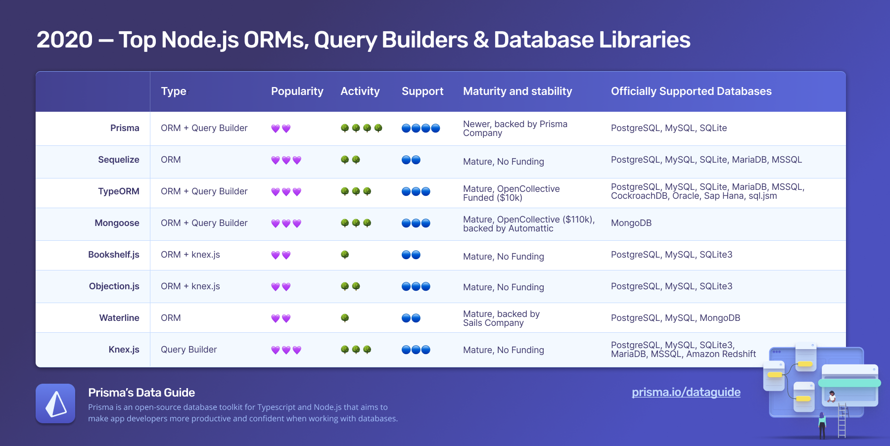

## Introduction

Choosing an ORM or query builder for your Node.js app can be daunting. There are many different libraries that allow you to query and manipulate data from your JavaScript application, and each varies in its design and level of abstraction.

This article is meant as a jumping-off point for choosing a library and summarizing data that a developer would look up before picking a tool for their project. It attempts to remain objective and make as few value judgments as possible.

It does not attempt to choose "one best library" or rank packages in an opinionated fashion. Instead, it summarizes the most popular Node.js query builders, ORMs, and database toolkits and describes their project health. This is done using criteria like popularity, repo activity, developer support, and project maturity.

**Note:** This article was originally published on September 18, 2020. It was most recently updated on February 15, 2022.

## Criteria: evaluating database libraries

This article will focus on the most popular Node.js query builders, ORMs, and database toolkits. Database drivers and newer libraries will briefly be considered at the end. Type safety and TypeScript support are not covered and will be evaluated in a forthcoming article.

Libraries will be briefly summarized and evaluated according to the following criteria:

| Criteria                 | Description                                                     | Evaluated by                                                                                                                             |
| ------------------------ | --------------------------------------------------------------- | ---------------------------------------------------------------------------------------------------------------------------------------- |
| **Popularity**           | How popular is the library amongst developers?                  | GitHub stars, npm downloads & [compound monthly growth rate](https://en.wikipedia.org/wiki/Compound_annual_growth_rate) in npm downloads |
| **Repo Activity**        | How active is development in the repo?                          | Commits, releases, merged PRs & GitHub issues                                                                                            |
| **Support**              | Will the developer be well supported?                           | Documentation quality, StackOverflow and Reddit presences, Gitter/Slack/IRC channels & GitHub issues                                     |
| **Maturity & Stability** | How new is this project? Is it stable and backed by supporters? | npm module and GitHub repo age, maintenance, financial investment, corporate backing & production use cases                              |

The month of data considered for this article is **January 15 2022 to February 15 2022**. Note that the packages on this page are presented in no particular order, meaning the list does not represent a dedicated ranking.

This criteria is not exhaustive and you should choose the tool that best suits your project and programming preferences.

## SQL, query builders, and ORMs

Libraries to query and manipulate data can broadly be grouped into three categories, each operating at a different level of abstraction.

From lowest to highest these are:

- Database drivers, clients and connectors, like [node-postgres](https://github.com/brianc/node-postgres)
- Query builders, like [Knex.js](https://knexjs.org/) that operate at a level above database clients and allow you to write JavaScript code to manipulate and query data
- Object-relational mapping tools (ORMs) like [Sequelize](https://sequelize.org/) and database toolkits like [Prisma](https://www.prisma.io/) that allow the developer to work with _models_, abstract entities that correspond to database tables

Many tools blur the lines between these and allow the developer to drop down to lower levels when additional flexibility or control is necessary. To learn more, please consult [Comparing SQL, query builders, and ORMs](https://www.prisma.io/dataguide/types/relational/comparing-sql-query-builders-and-orms) from Prisma’s [Data Guide](https://www.prisma.io/dataguide).

## Prisma

### Evaluation summary

- **Popularity**: Popular
- **Repo Activity**: Very active
- **Support**: Strong
- **Maturity and Stability:** Newer
- **Supported Databases**: MySQL, PostgreSQL, MSSQL, & SQLite (MongoDB, CockroachDB, and PlanetScale in Preview support)

### Overview

- [Website](https://www.prisma.io/)
- [GitHub](https://github.com/prisma/prisma)
- [npm: prisma](https://www.npmjs.com/package/prisma)
- [npm: @prisma/client](https://www.npmjs.com/package/@prisma/client)

Prisma differs from most ORMs in that models are not defined in classes but in the _Prisma schema_, the main configuration and data model definition file used by the Prisma toolkit. In the Prisma schema you define your data source, like a PostgreSQL database, and models, like `users` and `posts` and the relations between them. Using this schema, Prisma generates a _Client_ that exposes a Create-Read-Update-Delete (CRUD) API, which you then use to query your database. This Prisma Client functions as a rich query builder that you can use in your Node.js app to return plain JavaScript objects, not instances of a model class.

### Popularity

With 20.7k stars on the [Prisma GitHub repository](https://github.com/prisma/prisma), Prisma is a popular database tool among Node developers, comparable to established libraries like Bookshelf.js and Objection.js, but not quite as popular as libraries like Sequelize and TypeORM, which have more than 25k GitHub stars. It should be noted that Prisma has only been released for production in June 2020 while most other tools have been around for several more years.

In terms of npm downloads, with 362k weekly downloads at the time period considered, it is higher than tools like Bookshelf.js and Objection.js but is not quite in the same tier as Sequelize, TypeORM, and Mongoose. It is however growing at a higher rate among all the major tools considered for this article, with 94% npm download growth in the last 6 months.

**Evaluation:** Popular

### Repo activity

It is safe to say that the Prisma GitHub repo is the most active out of all the tools considered for this article. With 258 commits in the month of data considered for this article, 3 releases, and 101 merged PRs, Prisma is under active development. New features, bug fixes, and updates are pushed frequently, with new versions released every two weeks.

**Evaluation:** Very active

### Support

Although Prisma hasn't been around as long as some of the other tools considered here, it benefits from a strong and active developer support network. Its [documentation](https://www.prisma.io/docs) is well-organized, being actively expanded, and is quite thorough.

If you have a question, you can use the Prisma Slack channel, ask on their GitHub Discussions page, or file a GitHub Issue, all of which are quite active. Although there isn't quite as large a library of StackOverflow questions to draw from, the library of answered queries on GitHub discussions and Reddit more than makes up for this.

**Evaluation:** Strong

### Maturity and stability

Prisma was first created and released in 2016, making it one of the newer tools being considered for this article. It has gone through several iterations and redesigns, beginning as Graphcool, a GraphQL backend-as-a-service. Graphcool then pivoted into a database and GraphQL tool to become Prisma 1.0, a very popular project with 16.9k GitHub stars. Prisma 2.0, released in beta in 2020, then shed both the Prisma server and GraphQL layer to become the JavaScript and TypeScript ORM alternative it is today.

Prisma 2.0 is an open-source JavaScript ORM being maintained, supported, and actively developed by the private company Prisma, which recently closed a twelve-million-dollar Series A funding round. Prisma hires full-time engineers, developer advocates, technical writers, and more to maintain and build Prisma. This means that developers can be assured that they will be well-supported when implementing Prisma as their JavaScript database interface.

**Evaluation:** Newer

### Database support

Prisma currently supports **PostgreSQL, MySQL, MSSQL, and SQLite**. Additionally, MongoDB, PlanetScale, and CockroachDB are currently in Preview support.

### Notable features

- Work directly with JavaScript objects and not classes and instances
- A "single source of truth," the Prisma Schema, to reduce object-relational impedance mismatch
- Type-safe database queries
- Auto-generated migrations (preview)
- Intuitive relations API
- VSCode plugin
- Autocompletion support

For a full list of features consult [Database Features](https://www.prisma.io/docs/reference/database-reference/database-features) from the Prisma official documentation.

### Usage example

Relation query (fetch all posts by a given user, given user’s email):

```js
const postsByUser = await prisma.user
  .findOne({ where: { email: 'alice@prisma.io' } })
  .posts()
```

### Summary

Although Prisma is a newer database tool and has gone through several iterations and redesigns, its unique, schema-centric architecture stands in contrast to typical ORMs which use JavaScript Classes to define models. It benefits from the backing of a funded company and paid developers, as well as an active support community and quick development cycle. It is a popular, fast-growing choice, and is here to stay.

<PrismaOutlinks>

If you want to learn more about why we think Prisma is a great option, check out our [Why Prisma? page](https://www.prisma.io/docs/concepts/overview/why-prisma).

</PrismaOutlinks>

## Sequelize

### Evaluation summary

- **Popularity**: Very popular
- **Repo Activity**: Very active
- **Support**: Average
- **Maturity and Stability:** Very mature
- **Supported Databases**: MySQL, MariaDB, SQLite and Microsoft SQL Server

### Overview

- [Website](https://sequelize.org/)
- [GitHub](https://github.com/sequelize/sequelize/)
- [npm: sequelize](https://www.npmjs.com/package/sequelize)

Sequelize is an established, mature, promise-based Node.js ORM that supports PostgreSQL, MySQL, MariaDB, SQLite, and Microsoft SQL Server. It follows the traditional ORM pattern of defining models by extending a `Model` class. Operations like `SELECT` and `INSERT` are then performed using class methods. Relations are also defined using class methods like `hasMany()` and `belongsTo()`.

### Popularity

With 25.7k GitHub stars and 1.35 million npm weekly downloads in the time period considered, Sequelize is the most popular relational database ORM considered in this article. It is still growing, with a 14% growth in npm downloads over the past 6 months. For comparison, the next most popular _relational_ database ORM is TypeORM, with 918k weekly npm downloads. (Mongoose is also very popular but only supports MongoDB.)

**Evaluation:** Very popular

### Repo activity

In the time period considered, 10 new versions of Sequelize were released, 179 commits pushed (across all branches), and 86 PRs were merged. This indicates that Sequelize is very active.

**Evaluation:** Very active

### Support

Having been around for close to ten years, you are likely to find support for Sequelize through StackOverflow or Reddit searches. Its documentation is extensive, contains numerous usage examples, and also some more theoretical discussions of usage patterns (for example its [Associations](https://sequelize.org/master/manual/assocs.html) documentation). However, Sequelize's GitHub Issues and Slack channel could use some love, with many queries going unanswered.

**Evaluation:** Average

### Maturity and stability

Sequelize is one of the most mature Node ORMs available. It is no longer a rapidly shifting project and development lately seems to be maintenance-focused on bug fixes and documentation updates. It is a stable tool that relies entirely on open-source contributions from maintainers and the Sequelize community.

According to its [documentation](https://sequelize.org/master/manual/whos-using.html), it has some notable users like WalmartLabs and Bitovi.

**Evaluation:** Very mature

### Database support

PostgreSQL, MySQL, MariaDB, SQLite, and Microsoft SQL Server. It also supports CockroachDB using an external package.

### Notable features

- Familiar ORM interface and ActiveRecord usage patterns
- Detailed control over transactions and how they are executed
- Supports many databases
- Ability to use multiple read replicas
- [Eager and Lazy](https://sequelize.org/master/manual/eager-loading.html) loading of relations
- Synchronizing database based on defined Models

For a full list of features, consult the Sequelize [official documentation](https://sequelize.org/master/).

### Usage example

Relation query (all posts by a specific user, eager loading):

```js
const user = await User.findOne({
  where: {
    email: 'alice@sequelize.org',
  },
  include: Post,
})
```

### Summary

Sequelize is an established, stable ActiveRecord ORM and due to its popularity and heavy use over the years, you can expect to find support from places like StackOverflow, Reddit, and GitHub Issues. The project currently has significantly more activity than in recent years past, which is a good sign.

<PrismaOutlinks>

For a more focused comparison of Prisma and Sequelize, you can look at our [Sequelize comparison page](https://www.prisma.io/docs/concepts/more/comparisons/prisma-and-sequelize).

</PrismaOutlinks>

## TypeORM

### Evaluation summary

- **Popularity**: Very popular
- **Repo Activity**: Active
- **Support**: Good
- **Maturity and Stability:** Mature
- **Supported Databases**: MySQL, MariaDB, PostgreSQL, CockroachDB, SQLite, Microsoft SQL Server, Oracle, SAP Hana, sql.js

### Overview

- [Website](https://typeorm.io/#/)
- [GitHub](https://github.com/typeorm)
- [npm: TypeORM](https://www.npmjs.com/package/typeorm)

TypeORM is a Hibernate-influenced JavaScript and TypeScript ORM that can run on multiple platforms like Node.js, web browsers, and Cordova. It was built with TypeScript and type support in mind and supports both main ORM architecture patterns, Data Mapper and Active Record, offering the developer flexibility to choose between the two. It also includes a query builder.

### Popularity

Since its release in 2016, TypeORM has grown very rapidly to become one of the most popular JavaScript and TypeScript ORMs. It has 27.2k stars on GitHub and 918k weekly npm downloads, making it one of the most popular ORM choices, along with Sequelize and Mongoose.

**Evaluation:** Very popular

### Repo activity

TypeORM's GitHub repo is active. In the past month, 74 commits were pushed (to all branches), and 41 PRs were merged. There seems to be no strict release schedule, with the latest release occurring on November 2021.

**Evaluation:** Active

### Support

TypeORM's documentation is good, also covering database concepts like migrations, relations, and ORM patterns like Data Mapper and Active Record. It has a somewhat active Slack Community and moderate Reddit and StackOverflow presences, however you are unlikely to get much help using GitHub issues.

**Evaluation:** Good

### Maturity and stability

Although comparable in maturity to Prisma, TypeORM's design has shifted less since its initial release as a Hibernate-influenced ORM built for TypeScript (that also works well with JavaScript). It is entirely dependent on open-source contributions, but has some support with a roughly \$15000 annual budget from OpenCollective contributions. Notable corporate contributors include Cockroach Labs, Aplas, and VoterCircle Inc.

**Evaluation:** Mature

### Database support

MySQL, MariaDB, PostgreSQL, CockroachDB, SQLite, Microsoft SQL Server, Oracle, SAP Hana, sql.js

### Notable features

- Supports both Data Mapper and Active Record ORM patterns
- Powerful and flexible query builder
- Strong TypeScript support
- Eager and lazy loading of relations
- Automatic migrations generation
- Transaction support
- Supports many databases

For a full list of features, consult the TypeORM [GitHub README](https://github.com/typeorm/typeorm#features).

### Usage example

Query all posts by a specific user in TypeORM :

```js
const userRepository = getRepository(User)
const user = await userRepository.findOne(id, {
  relations: ['posts'],
})
```

### Summary

TypeORM and Sequelize are the two most popular relational database ORMs. TypeORM differs from Sequelize in that it offers a little more flexibility, allowing you to choose between different usage patterns and also includes a powerful query builder. TypeORM supports many popular databases, and the project is still active, although entirely dependent on its open source contributors.

<PrismaOutlinks>

For a more focused comparison of Prisma and TypeORM, you can look at our [TypeORM comparison page](https://www.prisma.io/docs/concepts/more/comparisons/prisma-and-typeorm).

</PrismaOutlinks>

## Mongoose

### Evaluation summary

- **Popularity**: Very popular
- **Repo Activity**: Active
- **Support**: Good
- **Maturity and Stability:** Mature
- **Supported Databases**: MongoDB

### Overview

- [Website](https://mongoosejs.com/)
- [GitHub](https://github.com/Automattic/mongoose)
- [npm: Mongoose](https://www.npmjs.com/package/mongoose)

Mongoose is a popular and well maintained Node.js object modeling tool for MongoDB. Strictly speaking, Mongoose is an _object document mapper_, because MongoDB is a document based database. It allows you to model your data using schemas and it includes built-in type casting, validation, query building, and business logic hooks.

### Popularity

Mongoose is the most popular JavaScript data modeling tool for MongoDB databases. It has 23.9k stars on GitHub and 1.9 million weekly npm downloads.

**Evaluation:** Very popular

### Repo activity

Mongoose's GitHub repo is quite active. In the past month there were 199 commits across branches, and 58 merged PRs. Recent commits have focussed on bug fixes, adding features, and documentation. Releases seem to be quite frequent, with 5 in the time period considered.

**Evaluation:** Active

### Support

Mongoose's documentation consists of usage guides for its most common operations, like querying, creating models, and validation. Its API docs also contain many useful snippets. It has a Slack and Gitter community (although both are relatively quiet), and you can expect to find a lot of support and tips on Reddit and StackOverflow. Its GitHub issues section also is quite active, with most issues receiving some sort of response or support from maintainers or other Mongoose users.

**Evaluation:** Good

### Maturity and stability

Mongoose has been around since 2011, making it one of the most mature projects considered in this article. If you want to use a Node.js ODM with MongoDB, you can trust that the Mongoose interface is not going to radically change and that it will be kept up to date with MongoDB releases. It boasts an impressive amount of open-source financial backing with a \$67k annual budget derived entirely from OpenCollective contributors. Through a series of acquisitions, Automattic, the company that owns Wordpress.com, Tumblr, and Simplenote, inherited Mongoose. Terra Vera, SixPlus, and Payment Ninja are all built using Mongoose.

**Evaluation:** Mature

### Database support

MongoDB

### Notable features

- Schemas and Models for your NoSQL database
- Validators, pre and post middleware hooks
- Reference documents in other collections using `populate()`
- Subdocuments: nest schemas in other schemas

For a full list of features, consult the Mongoose [official documentation](https://mongoosejs.com/docs/guides.html).

### Usage example

Relation query (fetch all posts by a given user, given user’s email):

```js
const userWithPosts = await User.findOne({
  email: 'alice@mongoose.com',
}).populate('posts')
```

### Summary

If you're using a MongoDB database with Node and want to use an ODM, Mongoose is a safe bet. It is a popular, mature project that continues to be actively maintained. It allows you to define a schema to model your data and provides features like validation, type casting, population, middleware, custom methods and query helpers.

<PrismaOutlinks>

For a more focused comparison of Prisma and Mongoose, you can look at our [Mongoose comparison page](https://www.prisma.io/docs/concepts/more/comparisons/prisma-and-mongoose).

</PrismaOutlinks>

## Bookshelf.js

### Evaluation summary

- **Popularity**: Popular
- **Repo Activity**: Not very active
- **Support**: Average
- **Maturity and Stability:** Mature
- **Supported Databases**: PostgreSQL, MySQL, and SQLite

### Overview

- [Website](https://bookshelfjs.org/)
- [GitHub](https://github.com/bookshelf/bookshelf)
- [npm: Bookshelf](https://www.npmjs.com/package/bookshelf)

Bookshelf.js is Node.js ORM built on top of the Knex.js query builder library. It is inspired by the Data Mapper ORM pattern and provides a pared-down interface for modeling and interacting with your data.

### Popularity

With 6.3k GitHub stars, Bookshelf.js isn't quite as popular as Sequelize and TypeORM but is in the same range as Objection.js and Waterline.js. It has 82k weekly downloads (compared to Sequelize's 1.35 million), which means that although it may not be as widely adopted it still has a core base of developers who prefer its leaner interface. Its popularity appears to be waning somewhat, with a decrease of 36% in npm download in the last 6 months.

**Evaluation:** Popular

### Repo activity

In the past month, there were no commits in the Bookshelf repo, no releases, and no merged pull requests. No new commits have been made to the main branch in about a year. The last release at the time of writing was `1.2.0` on June 7, 2020.

**Evaluation:** Not very active

### Support

Bookshelf's core documentation consists of a brief quick start guide and some code snippets on creating different relation types. Its API docs, however, are quite extensive and contain many usage examples. Bookshelf has an IRC channel, but there are only 7 members in it and it seems pretty quiet. Similarly, support on StackOverflow and Reddit is lighter. Your best bet is its GitHub Issues page, though you might still have trouble getting a contributor's attention.

**Evaluation:** Average

### Maturity and stability

Bookshelf.js has been around since 2013 and is quite mature at this point. Among its notable users are Ghost, Soapee, NodeZA, Sunday Cook, and FlyptoX. It is an open-source package with few maintainers and no financial or corporate backing.

**Evaluation:** Mature

### Database support

PostgreSQL, MySQL, and SQLite.

### Notable features

- Lean interface with a streamlined set of ORM features
- Built on top of Knex.js so can drop down and use query builder as necessary
- Promise and callback interfaces
- Eager and nested-eager relation loading
- Supports transactions
- Community plugins to extend functionality

For a full list of features, consult the [Bookshelf.js official documentation](https://bookshelfjs.org/).

### Usage example

Relation query (fetch all posts by a given user, given user’s email):

```js
const userWithPosts = await User.where(“email”,  “alice@bookshelf.js”).fetch({
    withRelated: [“posts”]
});
```

### Summary

Bookshelf.js is a pared-down ORM that gives you the standard set of data modeling, querying, and manipulation tools. Since it's built on top of the Knex.js query builder, you can always drop down and write more involved queries if you find yourself limited by its interface. It is not much of an active project anymore, but has been around for a long time and has a core user base that prefers its streamlined style.

## Objection.js

### Evaluation summary

- **Popularity**: Popular
- **Repo Activity**: Somewhat active
- **Support**: Good
- **Maturity and Stability:** Mature
- **Supported Databases**: SQLite, Postgres and MySQL

### Overview

- [Website](https://vincit.github.io/objection.js/)
- [GitHub](https://github.com/Vincit/objection.js)
- [npm: Objection](https://www.npmjs.com/package/objection)

Objection.js is self-described as more of a "relational query builder" than an ORM. Like Bookshelf.js, it is built on top of the powerful Knex.js query builder library, and so builds ORM-like features on top of a flexible query builder that you can always drop down to. [Objection to ORM Hatred](https://www.jakso.me/blog/objection-to-orm-hatred), written by the creator of the Objection.js library, concisely summarizes its design goals and where it fits in the raw SQL-to-ORM spectrum.

### Popularity

With 6.5k GitHub stars and 115k weekly npm downloads, Objection.js ranks close to Bookshelf.js in terms of popularity and behind Prisma. They are all not quite as popular as Sequelize and TypeORM, both in the 25k+ star and over 900k weekly download range.

**Evaluation:** Popular

### Repo activity

The Objection.js repo had no commits or merged PRs in the time period considered for this article. The last Objection release was on December 31, 2021, and included some bug fixes. Although not as active as projects like Prisma and TypeORM, it is actively maintained.

**Evaluation:** Somewhat active

### Support

Objection's docs consist of a usage guide covering its main functionality, like creating models and relations, querying, transactions, hooks, and validation. It also contains API docs and a "Recipe Book" with examples for common operations like joins and subqueries. You won't find much help on StackOverflow, but the project's Gitter is fairly active and supportive, it has a moderate Reddit presence, and its maintainer frequently responds to GitHub issues.

**Evaluation:** Good

### Maturity and stability

Objection has been out since 2015 and is a mature project. It does not seem to have any sort of financial or corporate backing and is maintained by the open-source community. For a list of production use cases of Objection.js, consult [Who uses objection.js in production?](Who uses objection.js in production?)

**Evaluation:** Mature

### Database support

SQLite, PostgreSQL, and MySQL

### Notable features

- Built on top of Knex.js
- Eager loading
- Transaction support
- Validate models against JSON Schema
- Query hooks (pre/post insert, update, etc.)
- Graph upserts
- Paging

For a full list of features, consult the [Objection.js GitHub README](https://github.com/Vincit/objection.js/#objectionjs).

### Usage example

Relation query (fetch all posts by a given user, given user’s email):

```js
const user = await User.query().findOne({
  email: 'alice@objection.js',
})

const posts = await user.$relatedQuery('posts')
```

### Summary

Objection.js is most similar to Bookshelf.js in that it builds a set of ORM-like features on top of the Knex.js query builder library. Objection.js seems to be more actively maintained and better documented, and many Objection.js developers formerly worked with Bookshelf.js according to [Who uses objection.js in production?](Who uses objection.js in production?)

## Waterline

### Evaluation summary

- **Popularity**: Somewhat Popular
- **Repo Activity**: Not very active
- **Support**: Average
- **Maturity and Stability:** Mature
- **Supported Databases**: MySQL, PostgreSQL, MongoDB. Via community adapters: Redis, MS-SQL, Oracle, and many more.

### Overview

- [Website](https://sailsjs.com/documentation/reference/waterline-orm)
- [GitHub](https://github.com/balderdashy/waterline)
- [npm: Waterline](https://www.npmjs.com/package/waterline)

Waterline is the default ORM used in the Sails Node.js framework. Part of its design is to allow you to use "write once, use anywhere" data manipulation code, so that you can write code to query or manipulate your data whether it lives in a MySQL, PostgreSQL, MongoDB, or other database.

### Popularity

Waterline is a popular ORM, with 5.3k GitHub stars and 37k weekly npm downloads. Its 37k npm weekly downloads make it the least popular of all the tools evaluated.

**Evaluation:** Somewhat popular

### Repo activity

Waterline's GitHub repo does not seem to be very active these days, with 0 commits and merged PRs in the month of data considered. Its last release was on October 22, 2021, with the release before that occurring in March of 2021.

**Evaluation:** Not very active

### Support

You are most likely going to be on your own if you run into any issues with Waterline. Its docs consists of a short section in the Sails.js docs, although its API is documented quite extensively and contains numerous usage examples. You can find additional support on the Sails Gitter (which seems to be quite active), and using GitHub Issues, although it will be on the Sails framework GitHub Issues page. It may be some time before you get an answer to your question or a fix gets pushed for your bug, though.

**Evaluation:** Average

### Maturity and stability

Waterline has been around since 2013 and is a mature package with a stable API. As part of the Sails.js JavaScript framework, it is managed and maintained by the Sails Company, a private, seed funded company that incubated at the Y Combinator startup incubator. Sails.js is a popular JavaScript framework used by Verizon, Postman, JetBlue, etc. but it is unclear how many production use cases depend on the standalone Waterline library.

**Evaluation:** Mature

### Database support

MySQL, PostgreSQL, MongoDB. Via community adapters: Redis, MS-SQL, Oracle, and many more.

### Notable features

- Write database-agnostic code
- Populate relations between models, even if the data for different models lives in different databases

For a full list of features, consult the [Waterline ORM GitHub README](https://github.com/balderdashy/waterline).

### Usage example

Relation query (fetch all posts by a given user, given user’s email):

```js
const userWithPosts = await User.find({ email: 'alice@waterline.js' }).populate(
  'posts'
)
```

### Summary

Waterline is the ORM/ODM built-in to the Sails.js JavaScript framework and as such its principal goal has been to support multiple database types (both relational and NoSQL) without having to rewrite code. In recent months the project has stagnated and support is not as strong as for some of the other libraries considered in this article.

## Knex.js (Query Builder)

### Evaluation summary

- **Popularity**: Very popular
- **Repo Activity**: Active
- **Support**: Good
- **Maturity and Stability:** Mature
- **Supported Databases**: PostgreSQL, Amazon Redshift, MySQL, MariaDB, SQLite, MSSQL

### Overview

- [Website](https://knexjs.org)
- [GitHub](https://github.com/knex/knex)
- [npm: knex](https://www.npmjs.com/package/knex)

Knex.js is a Node.js query builder (not ORM) that supports multiple databases and includes features like transaction support, connection pooling, and a streaming interface. It allows you to work at a level above the database driver and avoid writing SQL by hand. However, as it is a lower level library, familiarity with SQL and relational database concepts like joins and indices is expected.

### Popularity

With 15.4k GitHub stars and 1.04 million weekly npm downloads, Knex.js is a very popular JavaScript query builder.

**Evaluation:** Very popular

### Repo activity

In the month of data considered, Knex.js had 42 commits pushed across all branches, 26 merged PRs, and published 3 releases. Recent commits include bug fixes and features.

**Evaluation:** Active

### Support

Knex.js's docs mostly consist of full documentation of its API, which is extensive but can be quite spartan. Familiarity with relational databases, SQL, and its core set of features (joining, connections, etc.) is expected. It hosts an Gitter channel which isn't very active, but you may be able to find some support on StackOverflow and Reddit. Its GitHub Issues page seems to be quite active so you can be sure that your query will get looked at by a project maintainer.

**Evaluation:** Good

### Maturity and stability

Knex has been around since 2013 and is a mature project. It was designed as a "batteries-included" JavaScript query builder that supports multiple database drivers, and since then its interface has not changed much. It is an open-source project maintained entirely by the community, and although it is not as active as some of the other libraries considered in this article, minor releases are frequent and a handful of contributors continue to push fixes and improvements to the library.

**Evaluation:** Mature

### Database support

PostgreSQL, Amazon Redshift, MySQL, MariaDB, SQLite, MSSQL

### Notable features

- Callback and Promise interfaces
- Stream interface
- Query and Schema Builders
- Transaction Support
- Connection Pooling
- Standardizing responses between different query clients and dialects

For a full list of features, consult the [knex.js GitHub README](https://github.com/knex/knex#knexjs).

### Usage example

JOIN query (fetch all posts by a given user, given user’s email):

```js
const posts = await knex('posts')
  .join('users', {
    'users.id': 'posts.user_id',
    'users.email': 'alice@knex.js',
  })
  .select('*')
```

### Summary

Knex.js is different from most of the database tools considered in this article as it is _not_ an ORM or an abstraction layer that sits above your database used to model your data. It is a powerful, flexible query builder that acts as a wrapper around database drivers, allowing you to simplify some of your queries and remove boilerplate SQL. It is the most popular "pure" JavaScript query builder and is an actively maintained, mature project.

## Other notable libraries

This article has focussed on some of the most popular Node.js ORMs, database tools, and query builders, but there are several other tools you may wish to consider for your project:

### MassiveJS

- [Website](https://massivejs.org/)
- [GitLab](https://gitlab.com/dmfay/massive-js)
- [npm](https://www.npmjs.com/package/massive)

MassiveJS is a Node.js database tool for PostgreSQL that builds abstractions for working with your database but is _not_ a full-blown ORM with models and entities. Similar to Prisma, it can connect to your database and introspect its schemas to build an API for the data model encoded in your database. It includes a dynamic query builder and transaction support, and is designed for PostgreSQL so supports its unique feature set like array fields and operations, regular expression matching, foreign tables, and materialized views.

### Mikro-ORM

- [Website](https://mikro-orm.io/)
- [GitHub](https://github.com/mikro-orm/mikro-orm)
- [npm](https://www.npmjs.com/package/mikro-orm)

Mikro-ORM is a newer TypeScript ORM that also [supports vanilla JavaScript](https://mikro-orm.io/docs/usage-with-js/). Since it is primarily a TypeScript ORM, it was not fully evaluated for this article. Mikro-ORM is a fast growing project that is very active on GitHub and is strongly supported by its developers. Influenced by Doctrine (a PHP ORM), it is a Data Mapper, Identity Map, and Unit of Work influenced ORM. Some of its features include automatic transaction handling, support for multiple databases, a built-in Knex.js-based Query Builder, and Schema and Entity generators.

### Slonik

- [GitHub](https://github.com/gajus/slonik)
- [npm](https://www.npmjs.com/package/slonik)

Slonik sits at a level just above the `node-postgres` database driver. It is a collection of utilities that builds in type safety, query mocking, connection and transaction handling, detailed logging, value interpolation, and [many other features](https://github.com/gajus/slonik#features). You will still have to write raw SQL but it's designed to add a level of safety and efficiency when working with a PostgreSQL database. The library was released in 2017 and is still quite active and supported on GitHub.

### Database drivers

At the lowest level of the abstraction spectrum sit database drivers, which can be used to interact directly with your database using its query language. Summarizing every Node.js database client goes beyond the scope of this article but for convenience purposes, here is a list of the main database drivers:

- **PostgreSQL:** [node-postgres](https://github.com/brianc/node-postgres), [pg-promise](https://github.com/vitaly-t/pg-promise)
- **MySQL:** [mysql](https://github.com/mysqljs/mysql), [node-mysql2](https://github.com/sidorares/node-mysql2), [mysql-connector-nodejs](https://github.com/mysql/mysql-connector-nodejs)
- **SQLite:** [node-sqlite3](https://github.com/mapbox/node-sqlite3)
- **MSSQL**: [node-sqlserver-v8](https://github.com/TimelordUK/node-sqlserver-v8), [node-mssql](https://github.com/tediousjs/node-mssql), [tedious](https://github.com/tediousjs/tedious)
- **MongoDB**: [node-mongodb-native](https://github.com/mongodb/node-mongodb-native)
- **Redis:** [node-redis](https://github.com/NodeRedis/node-redis), [ioredis](https://github.com/luin/ioredis)

## Summary

<!--  -->

| Library          | Type                          | Popularity | Activity | Support  | Maturity and Stability                                      | Officially Supported Databases                                                               |
| ---------------- | ----------------------------- | ---------- | -------- | -------- | ----------------------------------------------------------- | -------------------------------------------------------------------------------------------- |
| **Prisma**       | ORM + Query Builder           | 💜💜       | 🌳🌳🌳🌳 | 🔵🔵🔵🔵 | Newer, backed by the company Prisma                         | PostgreSQL, MySQL, MariaDB, SQLite, MSSQL (MongoDB, CockroachDB, and PlanetScale in Preview) |
| **Sequelize**    | ORM                           | 💜💜💜     | 🌳🌳     | 🔵🔵     | Mature, no Funding                                          | PostgreSQL, MySQL, MariaDB, SQLite, MSSQL                                                    |
| **TypeORM**      | ORM + Query Builder           | 💜💜💜     | 🌳🌳🌳   | 🔵🔵🔵   | Mature, OpenCollective Funded (\$15k)                       | PostgreSQL, MySQL, MariaDB SQLite, MSSQL, CockroachDB, Oracle, Sap Hana                      |
| **Mongoose**     | ODM + Query Builder           | 💜💜💜     | 🌳🌳🌳   | 🔵🔵🔵   | Mature, OpenCollective Funded (\$67k), backed by Automattic | MongoDB                                                                                      |
| **Bookshelf.js** | ORM + Query Builder (knex.js) | 💜💜       | 🌳       | 🔵🔵     | Mature, no Funding                                          | PostgreSQL, MySQL, SQLite                                                                    |
| **Objection.js** | ORM + Query Builder (knex.js) | 💜💜       | 🌳🌳     | 🔵🔵🔵   | Mature, no Funding                                          | PostgreSQL, MySQL, SQLite                                                                    |
| **Waterline**    | ORM                           | 💜         | 🌳       | 🔵🔵     | Mature, backed by Sails Company                             | PostgreSQL, MySQL, MongoDB                                                                   |
| **Knex.js**      | Query Builder                 | 💜💜💜     | 🌳🌳🌳   | 🔵🔵🔵   | Mature, no Funding                                          | PostgreSQL, MySQL, MariaDB, SQlite, MSSQL, Oracle, Amazon Redshift                           |

## Conclusion

This article summarizes the most popular Node.js ORMs, database toolkits, and query builders. Their health as open-source projects is assessed according to criteria like repository contributions and developer support.

It is not meant as an exhaustive framework for choosing a Node.js database interface, and other factors like the package’s programming interface, design, support for your database’s features, and flexibility can be significantly more important than much of the criteria assessed here. Different Node.js projects may require different tools.

To learn more about query builders and ORMs, please consult [Comparing SQL, Query Builders, and ORMs](https://www.prisma.io/dataguide/types/relational/comparing-sql-query-builders-and-orms) from [Prisma’s Data Guide](https://www.prisma.io/dataguide), a free helpful knowledge base for learning about databases, data modeling, and much more.
