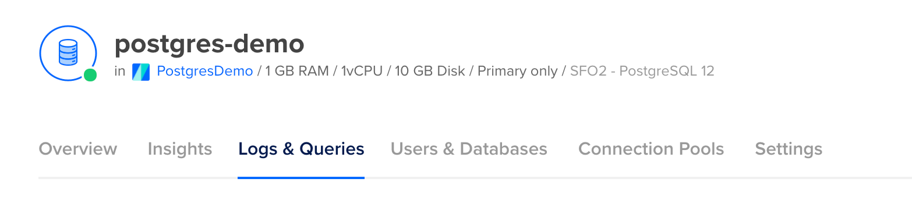
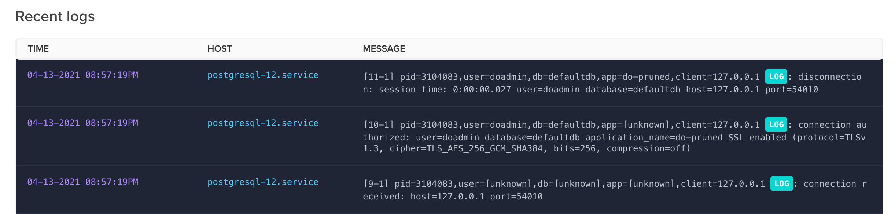
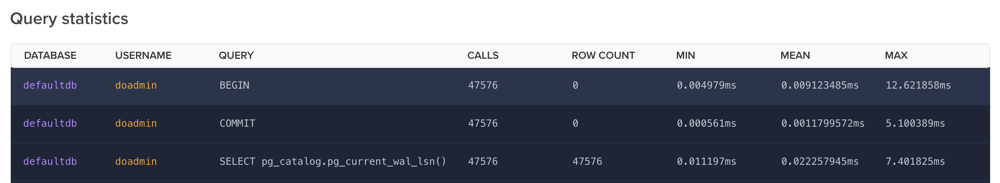

## Introduction

If your application has slowed down, there’s a very good chance the issue is related — at least in part — to your database.

Knowing that your application's performance problems might involve your database is a good first step to reducing lag. The tricky part is to find out _where_ and _why_ these [bottlenecks](/intro/database-glossary#bottleneck) might exist.

This article covers some of the most common issues that create performance bottlenecks in databases and some steps that can be taken to remediate them.

## Database logs and metrics

It's not possible to diagnose bottlenecks in your database without looking at the logs. Most cloud providers supply rich information for you to assess what's happening with your queries, but it can be difficult to know what that information is saying.

### Explore the logs, metrics, and query statistics

Most cloud database providers, including DigitalOcean, AWS, Google Cloud Platform, MongoDB Atlas, and others, offer a spot to view logs. It's important to get familiar with the layout and structure of this logging information so that you can more easily find problems later.

DigitalOcean, for example, provides a tab called "Logs & Queries" accessible directly from the deployment management menu.



In this section, there's a subsection called "Recent Logs" which provides a realtime display of logging information.



The information contained in these logs may or may not be useful for the specific bottleneck issue you're trying to troubleshoot. However, some information, such as the session duration, might give an indication of sessions that are spending a long time connected to the database.

### Explore the metrics dashboard

The metrics dashboard for your cloud database provider gives you the most insight into the bottlenecks you might be experiencing. Most cloud providers show performance-related information, such as:

- System and Process CPU usage
- Cache usage
- Memory
- Number of connections

Viewing the metrics for items such as system CPU usage might reveal problems related to resource constraints. You may see spikes in usage related to administrative tasks such as taking backups. Sustained high usage may indicate that your database server is underprovisioned.

### Explore query statistics

The query statistics reports from your cloud database provider might be the best source of information for determining where slowdowns are coming from. In many cases, slowdowns can be traced to queries that take a long time to execute.

Query statistics are reported differently between providers, but in most cases, the provider has a way to surface queries that are considered slow. Most providers show the query statement, the number of times it has been called, and the timing for that particular query.

For example, DigitalOcean's query statistics surfaces this information in tabular format.



## Unindexed tables

[Indexes](/intro/database-glossary#index) for a database table are conceptually similar to indexes in a book. Without an index in a book, you're left to look through every page to find the topic you're interested in. If, instead, the book has an index, you can search for a particular topic in the index first and you will be pointed to the correct page or pages. This drastically decreases the time it takes to find the information you're looking for.

The same concept is applied to database indexes. Adding indexes to a database table allows for fast lookups.

If you start out with a small amount of data in a table, it's common to not notice problems related to indexing immediately. As the data grows, however, a lack of indexing can become more apparent.

### Create indexes for your tables

Indexes for database tables need to be created based on common access patterns. When creating an index, you specify a column or field that the index should be built upon.

For example, if your table has an `email` field in a `users` table, you might have a query in your application that searches for users based on their email. Without an index in place, the query will search through the entire table to find the correct record. If, instead, you create an index on the `email` field, the query will first consult the index to look for the email value. Once found, it will be pointed to the specific database row for that user.

The best way to identify opportunities for adding indexes is to look for which queries are taking a long time to execute. This information can be found in the "Query Statistics" (or similar) section of your cloud provider's database dashboard.

All else being equal, it's best to first focus on the _slowest_ reported queries by adding indexes for the access pattern being used. You can then move down the list, adding indexes where required until the slow queries have been resolved.

Indexes can be created with raw [SQL](/intro/database-glossary#sql). While the specifics differ depending on the specific database being used, a SQL command to create an index might look like this:

```sql
CREATE INDEX email_index ON users (email);
```

With the index in place, inspect your query statistics over time to see if performance has improved.

### Use `EXPLAIN` to inspect slow queries

In some scenarios, the query statistics dashboard for your cloud database provider might not give you sufficient information. It may show you which queries are slow but it might not be clear which indexes should be created or how your queries should otherwise be optimized.

For these cases, you might choose to inspect your queries using the `EXPLAIN` statement. This statement is used in conjunction with your regular queries and is useful for getting detailed information about the query execution plan.

The `EXPLAIN` statement used ahead of a regular query in [PostgreSQL](/intro/database-glossary#postgresql), for example, will produce information such as:

- The estimated start-up cost
- The estimated total cost
- The estimated number of rows output
- The average width (in bytes) of the rows

For example, the following usage of `EXPLAIN`:

```sql
EXPLAIN SELECT * FROM users;
```

Will produce this report:

```sql
                         QUERY PLAN
-------------------------------------------------------------
 Seq Scan on users  (cost=0.00..458.00 rows=10000 width=244)
```

The `EXPLAIN` statement is a valuable tool to dig into specific queries and analyze their cost. The information gleaned from using `EXPLAIN` goes beyond what is provided by cloud providers in the query statistics reports and can be used to optimize your queries.

## Large data volumes

Queries that aren't optimized or that are overly broad in their scope might return inordinately large amounts of data from the database. It's often difficult to detect this issue when starting with a new database that has minimal data, but as the database size grows, it's likely to cause problems.

When a large amount of data is returned from a query, it needs to be scanned into memory on the database server. This can lead to CPU spikes and the need for burst mode usage. This can lead to crashes at your database server. If the data is returned from the database server, it maybe also be too large for your app server to handle if your app server is underprovisioned.

Addressing data overfetching requires that queries be optimized to scope the selection to relevant records. The solution is often to reach for the `WHERE` clause but you first need to find queries that are causing problems.

Your cloud database provider logs and metrics can give some indication that large amounts of data are being returned from the database. You might see burst credit usage or CPU spikes. It can, however, be difficult to tell which queries are responsible just from these metrics.

### Instrumentation in your app server

To get the full picture of which queries are responsible for returning large amounts of data, you can add instrumentation to your app server. Tools like New Relic, Datadog, and Dynatrace can monitor your app server and report on the size of data as it passes through. Looking for which endpoints or areas of your app server are processing large amounts of data can help you zero in on which database queries might be responsible.

## Query optimization

Query optimization is not a one-size-fits-all endeavor and is very much case-dependent. There are, however, some common types of optimizations that should be considered.

- **Scope queries to prevent overfetching** - Be sure to use the `WHERE` clause when applicable to reduce the total volume of data returned.
- **Select only the required fields** - In many cases, not all fields from your tables are required to furnish your application. Select only the specific fields your app requires to prevent overfetching.
- **Audit your schema** - Inspect your database [schema](/intro/database-glossary#schema) to look for opportunities to reduce complexity. Queries that rely on many joins often run slowly and can be improved by adjusting your schema to have fewer relationships.
- **Use database views** - Views are like tables but are produced ahead of time by running a query to pre-compute values that might otherwise be derived on the fly. Views have their own caveats and aren't right for all applications and use cases.

## Conclusion

Poor application performance can often be traced back to issues at the database. Very often, these issues are related to suboptimal queries.

There's no silver bullet for optimizing queries. However, diligent efforts to analyze and inspect where and why certain queries aren't performing well can be helpful to hone in on the the specific queries that should be adjusted. Once identified, adjustments to the queries such as adding indexes, scoping with a `WHERE` clause, and selecting on the required fields can yield much better performance.

<PrismaOutlinks>

If you are using Prisma, you can learn about how to measure and optimize your queries in our [performance and optimization docs](https://www.prisma.io/docs/orm/prisma-client/queries/query-optimization-performance).

</PrismaOutlinks>
