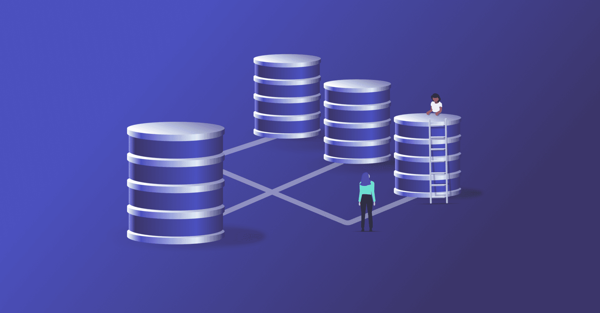
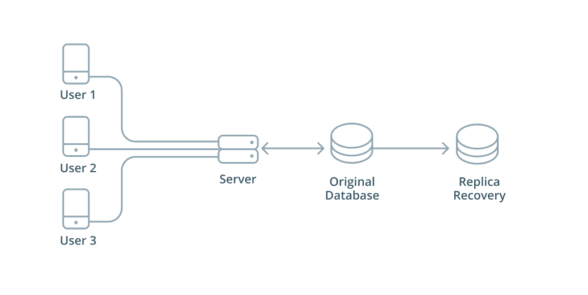

## Introduction

For many modern day applications, their backend is configured using a [distributed database](/intro/database-glossary#distributed-database). Data is stored and processed using an arrangement, or [cluster](/intro/database-glossary#cluster) of database servers, instead of relying on a single database server. The distributed model can ensure that data is still accessible even if one of the database servers suffers a failure. However, the distributed approach introduces the issue of making sure that all of the actors in the distributed system are up to date with the information that the end user is expecting to have returned to them. This introduces us to the topic of this guide: database replication.

In this guide, we will cover what database replication is and discuss the main benefits of having a database replication process in place for your distributed system.

## What is database replication?

**_Database replication_** is the process of maintaining a copy of data on multiple machines that are connected via a network. The process can be visualized like the following, where a lead database is sending its information to followers to replicate:

This image displays a specific kind of database replication architecture, but replication can also be done in different ways. The main goal is always the same, and that goal is to keep multiple copies of the same data in different places. How closely those copies keep up with each other depends on how replication is configured.

## How up to date are replicas?

Replicas receive each change after the primary has made it, so at any given moment a replica may not yet have the primary's latest data. The main choice is whether the primary waits for its replicas before it tells a client that a transaction has been committed.

### Asynchronous replication

With **asynchronous replication**, the default in both [PostgreSQL](https://www.postgresql.org/docs/current/warm-standby.html#STREAMING-REPLICATION) and [MySQL](https://dev.mysql.com/doc/refman/8.4/en/replication.html), the primary confirms a commit as soon as it has stored the change itself, and sends it on to the replicas afterwards. Commits don't wait for the replicas, but the replicas lag behind. The lag is typically under a second when a replica can keep up with the load, and grows when it can't or when the network is slow. Meanwhile, a read from a replica returns data that may already be out of date on the primary: an application that saves a change and then reads it back from a replica may not see its own write.

The lag also determines what can be lost when the primary fails. Transactions that the primary has committed but not yet sent are missing from the replicas:

1. An application commits a new order. The primary records it and confirms the commit, and the application tells the user the order is saved.
2. The primary crashes before the change reaches the replica.
3. The failure is detected, and the replica is promoted to be the new primary.
4. Clients reconnect to the new primary, which has never heard of the order.

If the old primary comes back, it still has the order and still acts as a primary. It has to be kept from accepting writes, and rejoining it as a replica of the new primary discards the transactions that only it has, unless someone recovers them by hand first.

### Synchronous replication

With **synchronous replication**, the primary doesn't confirm a commit until one or more replicas acknowledge that they've received the change, so a confirmed transaction survives the loss of the primary. The cost is latency, since every commit waits for at least a network round trip to a replica, and availability: in PostgreSQL, if no synchronous replica is available, commits wait until one is.

What a replica's acknowledgement promises depends on the setting. Once synchronous replicas are named in `synchronous_standby_names`, PostgreSQL's [`synchronous_commit`](https://www.postgresql.org/docs/current/runtime-config-wal.html#GUC-SYNCHRONOUS-COMMIT) parameter offers three levels:

- `remote_write`: the replica has received the change and written it out to its operating system. The change survives a crash of the replica's database server, but not of its operating system.
- `on` (the default): the replica has also flushed the change to durable storage. The change is lost only if the primary and the synchronous replicas all lose their storage.
- `remote_apply`: the replica has also applied the change, so queries on the replica can see it. This costs the most latency.

Only `remote_apply` makes a commit visible on the synchronous replicas by the time the client is told it succeeded. With `remote_write` or `on`, the change is safe on the replica but a read there may not see it yet. MySQL's [semisynchronous replication](https://dev.mysql.com/doc/refman/8.4/en/replication-semisync.html) waits until a replica has written the transaction to its relay log and flushed it to disk, not until the replica has applied it. If no replica acknowledges within a timeout, the MySQL source falls back to asynchronous replication until a replica catches up.

### Failover

Replacing a failed primary with a replica is called **failover**, and it isn't instantaneous. Something has to decide that the primary has failed, usually after it has stopped responding for longer than a timeout, and then promote a replica so that it accepts writes. PostgreSQL provides the promotion step but [leaves failure detection to external tools](https://www.postgresql.org/docs/current/warm-standby-failover.html). Until the new primary is ready, writes fail. Open connections to the old primary are broken, so clients have to reconnect, and transactions that were in progress have to be retried. Connection routing through DNS, a virtual IP address, or a proxy can make the reconnection automatic, but not invisible to the application. And with asynchronous replication, the new primary may be missing writes that the old one confirmed.

## Benefits of database replication

As briefly alluded to in the introduction, there are several reasons why one would want to have a distributed database and therefore implement database replication. Some of the most common benefits include the following:

- improve the availability of data
- increase the speed of data access
- enhance server performance
- accomplish preparation for disaster recovery
- improve analytics

### Improve the availability of data

_Replication_ improves the [availability](/intro/database-glossary#availability) of data because it prevents relying on a single point of failure and losing database access. If there were some sort of technical glitch, power outage, or any number of different occurrences that affected that single point, then your application would not be able to access the data needed for its proper function.

Data replication enhances the resiliency and reliability of systems by storing data across multiple nodes. If one node goes down, another one can take over with a copy of the data to keep operations running. The switch takes some time, though, and with asynchronous replication the copy may be missing the last changes made on the failed node (see [failover](#failover)).

### Increase the speed of data access

For organizations both large and small, there may be users located globally. Geographically distributed database replication helps ensure that for any given user in the organization that needs particular data that they can get it in a timely manner and without too much delay.

Replicating data to local servers in the locations near to where it is being accessed provides users with faster data access and queries. If a organization had a single node in the USA, then a user trying to pull data in Europe could experience [latency](/serverless/serverless-glossary#latency) when trying to access it. A organization with a cluster in the USA as well as a replicated cluster in Europe would ensure that this user can work efficiently with the data that they need when they need it.

### Enhance server performance

Database replication also reduces the load on the primary server of the database. If data was only able to be accessed on a single server, that server would be handling every request coming to the database. With replication, that load can be dispersed among other nodes in the distributed system. Because the other nodes hold copies of the data, some queries could get handled by secondary nodes and leave the primary to handle only certain reads or only writes. A secondary answers with the data as of the last change it has applied, so queries that must see the latest writes, like a user reloading something they just saved, may still need to go to the primary.

Saving the primary for handling [write operations](/intro/database-glossary#write-operation) can prove to be beneficial because if it were handling all [reads](/intro/database-glossary#read-operation) and writes that may put unwanted strain on the server's resources. Reading from the primary may make sense for a situation where there are not many operations coming in to the database. However, in times of scaling and growth, it is best practice to delegate tasks across a distributed system rather than putting all the load on a single node's plate.

### Accomplish preparation for disaster recovery

In the case of a catastrophe that takes out the primary, a replica still holds a copy of the data, up to the last change it received. Replication doesn't protect against bad writes, though: an accidental `DELETE` or a corrupting update is replicated like any other change.
While replicas are not backups themselves because they continuously apply changes, they can be a target for your database backups.

For instance, if you want to back up your data, you can turn replication off briefly on one of the secondaries to get data in a consistent state, back up the data when there are no more write operations incoming, and then restart replication to catch back up on new updates. The replica gives you a snapshot of consistent data to target for disaster recovery without interrupting operations.

An additional way replication facilitates preparation for disaster recovery is by explicitly configuring a replica to be a lagging follower. This replica would apply operations with a delay of a defined time. This delay allows the database monitoring team to notice an issue and avoid applying changes to the replica from a corrupted primary. They then can turn off the replication and have a mostly up-to-date server ready and running to keep operations going.

These methods add a level of enhanced data protection that would not be present without database replication.

### Improve analytics

Similar to the benefits mentioned from enhancing server performance, replication allows for the dedication of nodes specifically for analytics. By having copies of the data available outside of a single site/node, there is now the option to have a secondary that is specifically used only for running analytics on the data.

This makes it so any nodes handling write operations or other heavy reads are not strained also by handling analytics queries from database users. For example, your analytics team that is pulling data to put together user growth reports for the past quarter will have a dedicated node to work with and not strain any of the core nodes. This improves the performance experienced by the analytics team as well as keeping unnecessary load off the primary — all with data that trails the primary only by the replica's replication lag.

## Wrapping up

Database replication is an important process to implement for a successful distributed data system. In this article we briefly introduced what database replication is and the benefits it adds to your new or already existing application.

Database replication is not a one size fits all process, so it is important to know what benefits are most important to your team when configuring. We'll take the learned benefits and discuss the most common database replication architectures, methods, and types in additional guides.

<PrismaOutlinks>

To perform database migrations with [Prisma Client](https://www.prisma.io/docs/orm/prisma-client), use the [Prisma Migrate tool](https://www.prisma.io/docs/orm/prisma-migrate). Prisma Migrate analyzes your schema files, generates migration files, and applies them to target databases.

</PrismaOutlinks>
