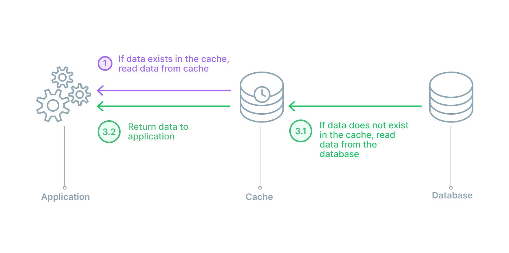

## Introduction

The database is a critical component to application performance. The difference between a well-performing and poor-performing database can be the most impactful factor on overall application performance. Database challenges like query processing speed, cost to scale, and ease of data access make finding an optimized balance difficult. It is difficult to accommodate for all three among many other considerations.

In this article, we discuss database caching, a technique implemented for databases to ease some of these aforementioned challenges. We introduce what database caching is, the benefits of database caching implementation on your data store, and different database caching strategies.

<PrismaOutlinks>

Checkout the [Prisma Data Platform](https://pris.ly/dg/pdp) to manage all of your application data in a single place.

</PrismaOutlinks>

## What is database caching?

Database caching is a buffering technique that stores frequently-queried data in temporary memory. A [cache](/intro/database-glossary#cache) is a high-speed data storage layer which stores a subset of data that is often [read](/intro/database-glossary#read-operation) requested. This transient storage layer results in future requests for this data to be served up faster than is possible by accessing the primary database.

A database caching strategy assists your primary database by easing the burden it might carry. This is most commonly seen by the rerouting of queries for frequently read data to the cache itself, rather than the primary database. The cache itself, resides in either the database, application, or even as a standalone access layer.

For example, your application requests user information from the database for the first time, this request goes from application server to database server and returns back the requested information. With caching, this user profile is stored closer to the requester after initial read, and there is a significant reduction in query processing time and database workload for all subsequent read requests for that data.

## What are the benefits of database caching?

Data retrieval speed greatly affects the user experience of an application. Implementing a caching strategy on your database can result in improved database performance, availability, and scalability for minimal cost depending on the strategy, all factors contributing to an overall positive application experience.

### Performance

As touched on briefly, database caching improves the performance of a database by making data more easily accessed. The cache acts as a sort of “keyboard short-cut” or “hot-key” for the application to reference data that it frequently is calling upon.

This speedier request can minimize the workload of the database, keeping it from spending inefficient amounts of time doing repetitive tasks. Instead making these tasks more efficient and simplifying data access.

### Availability

While not a 100% failover strategy, caching also provides benefits to overall database [availability](/intro/database-glossary#availability). Depending on where the cache is stored, the cache can still provide a place for the application to call upon for data in the case of the primary database server becoming unavailable for any reason.

While database performance is generally the primary reason for adopting a caching strategy, you also have the added benefit of some additional resiliency in the case of any backend failures.

### Scalability

Similarly to added high availability, database caching has a positive effect on [scalability](/intro/database-glossary#scaling). While it shouldn’t be your main consideration for a database scaling strategy, implementing caching to improve database performance reduces your database workload, therefore distributing backend queries across entities.

This distribution lightens the load on a primary database and can reduce costs and provide more flexibility in the processing of your data. This result alleviates the need to scale and does more with the resources you already have on hand, potentially pushing the need to scale into the future.

## What are the different database caching strategies?

Before adopting database caching into your data access flow, it is important to consider which caching strategy is best suited for the job. For any scenario, the relationship between the database and the cache can have a different impact on performance and system structure. Planning ahead and considering all options will lead to fewer headaches down the road.

The five most popular strategies to consider are cache-aside, read-through, write-through, write-back, and write-around. We’ll cover the data source to cache relationship and process of each strategy.

### Cache-aside

In a [cache-aside](/intro/database-glossary#cache-aside) arrangement, the database cache sits next to the database. When the application requests data, it will check the cache first. If the cache has the data (a cache hit), then it will return it. If the cache does not have the data (a cache miss), then the application will query the database. The application then stores that data in the cache for any subsequent queries.

A cache-aside design is a good general purpose caching strategy. This strategy is particularly useful for applications with read-heavy workloads. This keeps frequently read data close at hand for the many incoming read requests. Two additional benefits stem from the cache being separated from the database. In the instance of a cache failure, the system relying on cache data can still go directly to the database. This provides some resiliency. Secondly, with the cache being separated, it can employ a different data model than that of the database.

On the other hand, the main drawback of a cache-aside strategy is the window being open for inconsistency from the database. Generally, any data being written will go to the database directly. Therefore, the cache may have a period of inconsistency with the primary database. There are different cache strategies to combat this depending on your needs.

### Read-through

In a [read through cache](/intro/database-glossary#read-through-caching) arrangement, the cache sits between the application and the database. It can be envisioned like a straight line from application to database with the cache in the middle. In this strategy, the application will always speak with the cache for a read, and when there is a cache hit, the data is immediately returned. In the case of a cache miss, the cache will populate the missing data from the database and then return it to the application. For any data [writes](/intro/database-glossary#write-operation), the application will still go directly to the database.

Read-through caches are also good for read-heavy workloads. The main differences between read-through and cache-aside is that in a cache-aside strategy the application is responsible for fetching the data and populating the cache, while in a read-through setup, the logic is done by a library or some separate cache provider. A read-through setup is similar to a cache-aside in regards to potential data inconsistency between cache and database.

A read-through caching strategy also has the disadvantage of needing to go to the database to get the data anytime a new read request comes through. This data has never been cached before so therefore the data needs to be loaded. It is common for developers to mitigate this delay by ‘warming’ the cache by issuing likely to happen queries manually.

### Write-through

A [write-through caching](/intro/database-glossary#write-through-caching) strategy differs from the previously two mentioned because instead of writing data to the database, it will write to the cache first and the cache immediately writes to the database. The arrangement can still be visualized like the read-through strategy, in a straight line with the application in the middle.

The benefit to a write-through strategy is that the cache is ensured to have any written data and no new read will experience delay while the cache requests it from the main database. If solely making this arrangement, there is the big disadvantage of extra write latency because the action must go to the cache and then to the database. This should happen immediately, but there is still two writes occuring in succession.

The real benefit comes from pairing a write-through with a read-through cache. This strategy will adopt all the aforementioned benefits of the read-through caching strategy with the added benefit of removing the potential for data inconsistency.

### Write-back

[Write-back](/intro/database-glossary#write-back-caching) works almost exactly the same as the write-through strategy except for one key detail. In a write-back strategy, the application again writes directly to the cache. However, the cache does not immediately write to the database, and it instead writes after a delay.

By writing to the database with a delay instead of immediately, the strain on the cache is reduced in a write-heavy workload. This makes a write-back, read-through combination good for mixed workloads. This pairing ensures that the most recently written data and accessed data is always present and accessible via the cache.

The delay in cache to database writes can improve overall write performance and if batching is supported then also a reduction in overall writes. This opens up the potential for some cost savings and overall workload reduction. However, in the case of a cache failure, this delay opens the door for possible data loss if the batch or delayed write to the database has not yet occurred.

### Write-around

A [write-around caching](/intro/database-glossary#write-around-caching) strategy will be combined with either a cache-aside or a read-through. In this arrangement, data is always written to the database and the data that is read goes to the cache. If there is a cache miss, then the application will read to the database and then update the cache for next time.

This particular strategy is going to be most performant in instances where data is only written once and not updated. The data is read very infrequently or not at all.

## Conclusion

In this guide, we introduced the concept of database caching. We covered the main benefits that configuring a caching strategy can have on your database and application performance. We also discussed the basics of various caching strategies and how those arrangements can be visualized and optimised to work together.

Configuring a caching strategy that optimizes your cache and database workloads can have a major positive impact on the performance, availability, and scalability of your application. It is critical to know where to start and what options you have.

<PrismaOutlinks>

Checkout the [Prisma Data Platform](https://pris.ly/dg/pdp) to manage all of your application data in a single place.

</PrismaOutlinks>
