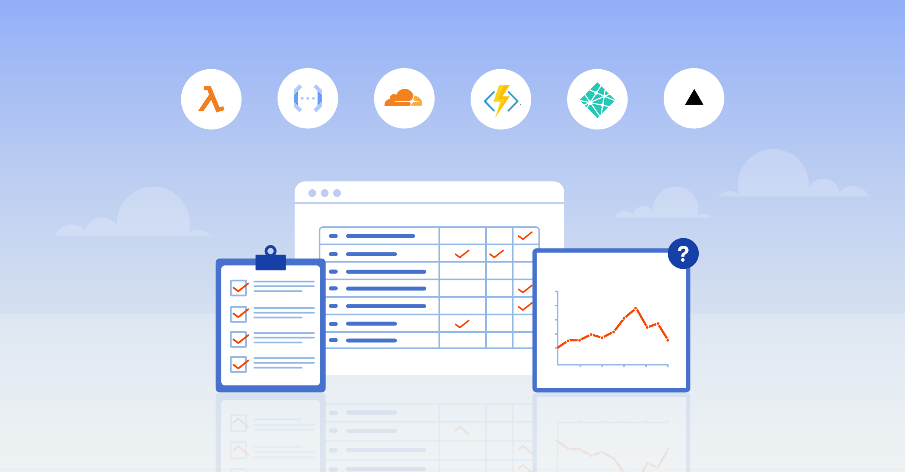

## Introduction

[Serverless computing](https://www.prisma.io/dataguide/serverless/what-is-serverless) is an established approach to cloud computing. Serverless providers allow developers to focus on the functionality that their applications require without worrying about the execution environment or any of the other lower level layers.

This article lists some of the most popular serverless compute providers and serverless databases, with links to each provider's current documentation for runtimes, limits and billing, and the dimensions worth comparing. It doesn't rank them: no single serverless provider is appropriate for every user, and limits and prices change too often for a fixed ranking to stay accurate.

## Overview of providers and evaluation criteria

Compute platforms execute your code. Database services persist and query data. Compare these separately: a function's scaling limits do not describe a database's connection limit, durability or recovery features.

The provider details below reflect each provider's documentation as of **30 September 2026**. Plan, region, runtime and account quotas can change. Follow the linked current limit and billing pages before choosing a deployment. Preview features are separate from each provider's established service.

For compute, compare event integrations, supported runtimes, duration and concurrency limits, network access, deployment workflow and billing dimensions. For databases, also compare transaction semantics, connectivity, connection limits, backup/restore, idle behavior and data residency. Include logs, gateways, storage, network transfer and any minimum charges in your cost model. An introductory free allowance does not establish a production cost.

For every compute provider below, check its supported event sources, deployment tooling, regional placement and the path from your function to its database. Tell the established service apart from experimental runtimes or features by the provider's own release and support labels. Before adopting a platform, test one representative request path on the plan and runtime you'd use, including database access and its failure cases.

## AWS Lambda

### Overview

- **Product:** AWS Lambda
- **Focus:** AWS event-driven functions
- **Documentation checked:** 30 September 2026

### Language support

Node.js 22 and 24 appear in the supported-runtime table. Node.js 26 and Python 3.15 are explicitly preview runtimes. Other managed languages and OS-only custom runtimes have separate lifecycle dates; use the runtime identifier for a supported release. See [the maintained runtime documentation](https://docs.aws.amazon.com/lambda/latest/dg/lambda-runtimes.html).

### Price

Requests and allocated-memory execution duration; additional features have their own charges. See [current pricing](https://aws.amazon.com/lambda/pricing/). These are billing dimensions, not a quote; rates vary by account and region.

### Limitations

Consult [the current execution limits](https://docs.aws.amazon.com/lambda/latest/dg/gettingstarted-limits.html) for duration, memory, concurrency and payload constraints for your chosen mode. Database connections must have their own capacity budget even when function instances scale automatically.

## Microsoft Azure Functions

### Overview

- **Product:** Microsoft Azure Functions
- **Focus:** Event-driven functions with Azure integrations
- **Documentation checked:** 30 September 2026

### Language support

Language versions depend on the Functions runtime and hosting plan. Consult the supported-language table rather than using the old Node.js 6–14 or .NET Core 2.1 installation choices. See [the maintained runtime documentation](https://learn.microsoft.com/en-us/azure/azure-functions/supported-languages).

### Price

Consumption depends on the plan; compare Flex Consumption, Premium and Dedicated billing separately. See [current pricing](https://azure.microsoft.com/en-us/pricing/details/functions/). These are billing dimensions, not a quote; rates vary by account and region.

### Limitations

Consult [the current execution limits](https://learn.microsoft.com/en-us/azure/azure-functions/functions-scale) for duration, memory, concurrency and payload constraints for your chosen mode. Database connections must have their own capacity budget even when function instances scale automatically.

## Google Cloud Functions

### Overview

- **Product:** Cloud Run functions (formerly Cloud Functions)
- **Focus:** Cloud Run functions and Google Cloud event integrations
- **Documentation checked:** 30 September 2026

### Language support

The product is now documented as Cloud Run functions. First-generation functions remain a distinct platform with different limits; runtime availability is listed separately from the generation comparison. See [the maintained runtime documentation](https://docs.cloud.google.com/run/docs/runtimes).

### Price

Compute, memory, requests and network transfer, with build and artifact-storage costs where applicable. See [current pricing](https://cloud.google.com/run/pricing). These are billing dimensions, not a quote; rates vary by account and region.

### Limitations

Consult [the current execution limits](https://docs.cloud.google.com/run/docs/functions/comparison) for duration, memory, concurrency and payload constraints for your chosen mode. Database connections must have their own capacity budget even when function instances scale automatically.

## Cloudflare Workers

### Overview

- **Product:** Cloudflare Workers
- **Focus:** Functions in the Workers runtime
- **Documentation checked:** 30 September 2026

### Language support

Workers provide web APIs and Node.js compatibility APIs when configured. Compatibility is not the same as an unrestricted Node.js server; check the APIs your driver uses. See [the maintained runtime documentation](https://developers.cloudflare.com/workers/runtime-apis/nodejs/).

### Price

Requests and CPU time on the Standard model; storage and other services have separate charges. See [current pricing](https://developers.cloudflare.com/workers/platform/pricing/). These are billing dimensions, not a quote; rates vary by account and region.

### Limitations

Consult [the current execution limits](https://developers.cloudflare.com/workers/platform/limits/) for duration, memory, concurrency and payload constraints for your chosen mode. Database connections must have their own capacity budget even when function instances scale automatically.

## Netlify Functions

### Overview

- **Product:** Netlify Functions
- **Focus:** Functions integrated with site builds and deployments
- **Documentation checked:** 30 September 2026

### Language support

Use Netlify's current supported runtimes and distinguish synchronous, background and edge functions. They have different execution contracts. See [the maintained runtime documentation](https://docs.netlify.com/build/functions/overview/).

### Price

Plan-specific credits or legacy billing; include compute, requests and bandwidth in the selected plan. See [current pricing](https://www.netlify.com/pricing/). These are billing dimensions, not a quote; rates vary by account and region.

### Limitations

Consult [the current execution limits](https://docs.netlify.com/build/functions/overview/) for duration, memory, concurrency and payload constraints for your chosen mode. Database connections must have their own capacity budget even when function instances scale automatically.

## Vercel Functions

### Overview

- **Product:** Vercel Functions
- **Focus:** Functions integrated with application deployments
- **Documentation checked:** 30 September 2026

### Language support

Choose a documented runtime. Official and community runtimes have different support boundaries; Node.js functions and Edge runtime code do not have identical API support. See [the maintained runtime documentation](https://vercel.com/docs/functions/runtimes).

### Price

Fluid compute bills active CPU, provisioned memory and invocations; legacy usage is documented separately. See [current pricing](https://vercel.com/docs/functions/usage-and-pricing). These are billing dimensions, not a quote; rates vary by account and region.

### Limitations

Consult [the current execution limits](https://vercel.com/docs/functions/limitations) for duration, memory, concurrency and payload constraints for your chosen mode. Database connections must have their own capacity budget even when function instances scale automatically.

## Serverless computing adjacent: serverless databases

The following services store data rather than run your function code. A managed database is not necessarily an automatically scaling or scale-to-zero database.

### Amazon DynamoDB and Aurora Serverless

[DynamoDB](https://aws.amazon.com/dynamodb/pricing/) offers provisioned and on-demand capacity for a non-relational data model, with request, storage and additional-feature billing. [Aurora serverless](https://docs.aws.amazon.com/AmazonRDS/latest/AuroraUserGuide/aurora-serverless-v2.html) is an autoscaling configuration of Aurora's relational engines. Review its engine/region requirements and capacity, storage and I/O charges separately; do not reuse Aurora Serverless v1 instructions.

### Microsoft Cosmos DB Serverless and Azure SQL Serverless

[Cosmos DB serverless](https://learn.microsoft.com/en-us/azure/cosmos-db/serverless) bills request units and storage for supported account configurations. [Azure SQL Database's serverless tier](https://learn.microsoft.com/en-us/azure/azure-sql/database/serverless-tier-overview) scales compute within configured bounds; compute, storage and auto-pause behavior depend on the tier and configuration. They use different data models and do not share the same request or transaction contract.

### Google Firestore

[Cloud Firestore](https://firebase.google.com/docs/firestore/pricing) is a document database. Its billing includes document/index operations, storage and network usage; location and query behavior affect the bill. Read its data-model and query restrictions before treating it as a replacement for a relational database.

### PlanetScale

[PlanetScale](https://planetscale.com/docs) documents distinct Postgres, Vitess and Neki products. Choose the engine explicitly; their drivers and operational features differ. [Pricing](https://planetscale.com/pricing) depends on the product, cluster configuration and region. The old description of a universally free serverless MySQL plan is not a current deployment instruction.

### MongoDB Atlas Serverless

Atlas Serverless instances are a retired offering, not a candidate for a new deployment. MongoDB's [migration documentation](https://www.mongodb.com/docs/atlas/flex-migration/) records the end of Serverless tooling support. Use [the current Atlas cluster creation instructions](https://www.mongodb.com/docs/atlas/tutorial/create-new-cluster/) for available products and [Atlas pricing](https://www.mongodb.com/pricing) for their billing; do not reuse the old Serverless instance API recipe.

### CockroachDB Serverless

CockroachDB's cloud product names and editions have changed since this article's original publication. The [pricing page](https://www.cockroachlabs.com/cockroachdb/pricing/) labels Basic, Standard and Advanced pricing as legacy terms for earlier clusters and directs new deployments to Cockroach Continuum pricing. Select the current edition and its compute/storage billing; do not assume an older Serverless quota or rate applies to a new cluster.

### Fauna

The hosted Fauna service ended on May 30, 2025, according to its [end-of-life FAQ](https://docs.fauna.com/fauna/current/eol-faq/). It is retained here to explain older references, not as a current hosted-service recommendation.

### Neon

[Neon](https://neon.com/docs/introduction/plans) is a managed PostgreSQL service with separate compute and storage, branching and plan-specific scaling behavior. Review the selected plan's compute, storage, branch and transfer billing. Branches do not remove the need to control credentials, data sensitivity and cleanup.

## Connecting to databases from serverless functions

Because the instances used by serverless providers to execute functions are, by nature, ephemeral, it is easy to exhaust the connection pool of a backing database if too many function instances are active at once. Two kinds of tools help.

### Serverless drivers

A serverless driver sends queries over HTTP or WebSockets instead of holding a TCP connection open, which suits platforms that can't keep TCP connections or a connection pool between requests:

- The [Prisma Postgres serverless driver](https://www.prisma.io/docs/postgres/database/serverless-driver) connects to Prisma Postgres over HTTP and WebSockets.
- The [Neon serverless driver](https://neon.com/docs/serverless/serverless-driver) queries Neon over HTTP or WebSockets.
- The [PlanetScale serverless driver](https://planetscale.com/docs/vitess/tutorials/planetscale-serverless-driver) queries PlanetScale's Vitess (MySQL) databases over HTTP. PlanetScale's Postgres databases [support the Neon serverless driver](https://planetscale.com/docs/postgres/connecting/neon-serverless-driver).

### Connection poolers

A connection pooler keeps a pool of database connections that many function instances share. [Cloudflare Hyperdrive](https://developers.cloudflare.com/hyperdrive/) does this for Cloudflare Workers and any PostgreSQL or MySQL database: it sets up new connections near your Workers, pools connections near your database, and caches query results. [Prisma Postgres](https://www.prisma.io/docs/postgres/database/connection-pooling) includes connection pooling as well.

## Other compute platforms

### Deno Deploy

[Deno Deploy is generally available](https://deno.com/blog/deno-deploy-is-ga). The old beta-only description referred to an earlier platform. Evaluate the current Deploy runtime and its Node.js/npm compatibility using the current documentation. Its [pricing and limits](https://docs.deno.com/deploy/pricing_and_limits/) distinguish the selected plan's compute, requests, storage and transfer allowances. The Deploy product, Deploy Classic and Subhosting are separate offerings; don't mix their limits.

<PostgresCallout />

## Wrapping up

Choose a compute platform and a database service using your application's requirements, then test them together. Confirm the runtime's stable or preview status, the database driver's transport, pool/session behavior, network location, limits and recovery path. Record the exact plan, region and observed workload in your own comparison. The linked provider documentation is the source for current quotas and rates.
